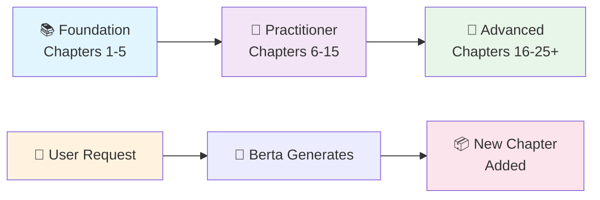
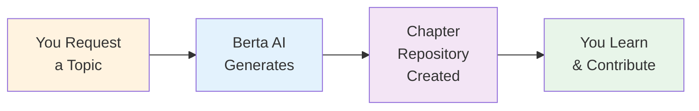
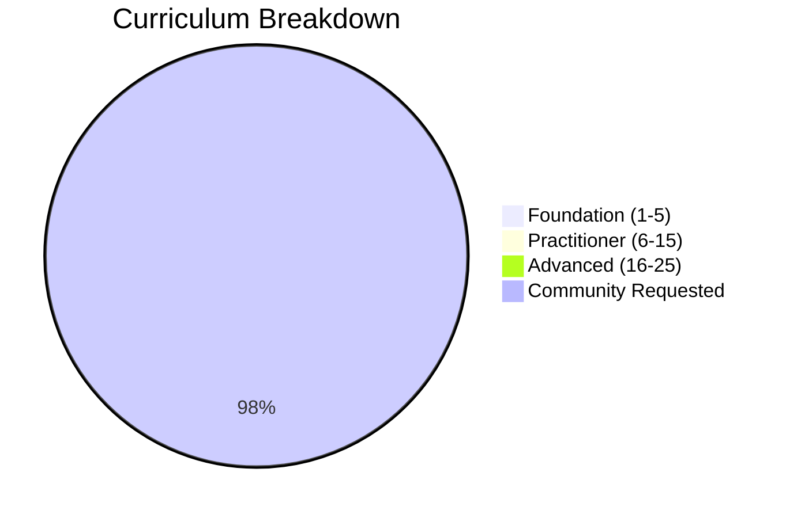

# 🤖 Berta Chapters

**Learn AI from fundamentals to mastery through interactive, executable chapters.**

Every chapter is generated by **Berta AI**. Every chapter is free, open-source, and yours to fork, clone, and modify.

---

## 🎯 How This Works

This repository contains **TWO types of chapters**:

### 1. 📖 The Curriculum Path
A structured, comprehensive learning journey from Python basics to advanced AI specializations.  
**Start here** if you're new to AI or want a guided progression.

### 2. ✨ Community-Requested Chapters
Special chapters created on-demand based on what **you** need to learn.  
**Request a chapter** on any AI topic, and Berta will generate it for you.



---

## 📚 The Curriculum Path

### Foundation Track (Master the Basics)
Learn essential skills for AI: Python, data structures, math, and computational thinking.

| Chapter | Topic | Time | Status |
|---------|-------|------|--------|
| 1 | [Python Fundamentals for AI](./chapters/chapter-01-python-fundamentals/) | 8h | ✅ Available |
| 2 | [Data Structures & Algorithms](./chapters/chapter-02-data-structures/) | 6h | ✅ Available |
| 3 | [Linear Algebra & Calculus](./chapters/chapter-03-linear-algebra/) | 10h | ✅ Available |
| 4 | Probability & Statistics | 8h | 🔄 Coming Soon |
| 5 | Software Design & Best Practices | 6h | 🔄 Coming Soon |

### Practitioner Track (Build Real Systems)
Apply what you've learned to real-world machine learning and AI problems.

| Chapter | Topic | Time | Status |
|---------|-------|------|--------|
| 6 | Introduction to Machine Learning | 8h | 🔄 Coming Soon |
| 7 | Supervised Learning: Regression & Classification | 10h | 🔄 Coming Soon |
| 8 | Unsupervised Learning: Clustering & Dimensionality Reduction | 8h | 🔄 Coming Soon |
| 9 | Deep Learning Fundamentals | 12h | 🔄 Coming Soon |
| 10 | Natural Language Processing Basics | 10h | 🔄 Coming Soon |
| 11 | Large Language Models & Transformers | 10h | 🔄 Coming Soon |
| 12 | Prompt Engineering & In-Context Learning | 6h | 🔄 Coming Soon |
| 13 | Retrieval-Augmented Generation (RAG) | 8h | 🔄 Coming Soon |
| 14 | Fine-tuning & Adaptation Techniques | 8h | 🔄 Coming Soon |
| 15 | MLOps & Model Deployment | 8h | 🔄 Coming Soon |

### Advanced & Specialization Track (Master Complex Topics)
Dive deep into cutting-edge techniques and specialized domains.

| Chapter | Topic | Time | Status |
|---------|-------|------|--------|
| 16 | Multi-Agent Systems Architecture | 10h | 🔄 Coming Soon |
| 17 | Advanced RAG & Knowledge Systems | 10h | 🔄 Coming Soon |
| 18 | Reinforcement Learning Fundamentals | 12h | 🔄 Coming Soon |
| 19 | Model Optimization & Inference | 8h | 🔄 Coming Soon |
| 20 | Building Production AI Systems | 10h | 🔄 Coming Soon |
| 21 | AI for Finance (Specialized) | 10h | 🔄 Coming Soon |
| 22 | AI Safety & Alignment | 8h | 🔄 Coming Soon |
| 23 | Building Your Own AI Products | 8h | 🔄 Coming Soon |
| 24 | Research & Cutting-Edge Techniques | 8h | 🔄 Coming Soon |
| 25 | AI Governance & Ethics | 6h | 🔄 Coming Soon |

---

## 🛤️ Learning Paths

Choose your journey. Each path combines chapters in a specific sequence based on your goals.

### Path A: "AI Engineer"
Comprehensive progression covering all major AI domains.
- **Chapters**: 1 → 2 → 3 → 4 → 5 → 6 → 9 → 11 → 13 → 15 → 20
- **Total Time**: ~110 hours
- **Skills**: Full-stack AI engineering, systems thinking, deployment
- **Best For**: Building diverse AI applications

### Path B: "ML Specialist"
Deep dive into machine learning theory and practice.
- **Chapters**: 1 → 2 → 3 → 4 → 6 → 7 → 8 → 9 → 15 → 19 → 20
- **Total Time**: ~100 hours
- **Skills**: Advanced ML, model optimization, production systems
- **Best For**: Machine learning engineers and researchers

### Path C: "LLM & NLP Expert"
Specialized focus on language models and NLP.
- **Chapters**: 1 → 5 → 10 → 11 → 12 → 13 → 14 → 17 → 20 → 23
- **Total Time**: ~90 hours
- **Skills**: LLM expertise, prompt engineering, RAG systems
- **Best For**: NLP specialists, LLM application builders

### Path D: "AI for Finance"
Finance-specific AI techniques (designed with trading/treasury expertise).
- **Chapters**: 1 → 3 → 4 → 6 → 7 → 21 → 19 → 20 → 23
- **Total Time**: ~85 hours
- **Skills**: Financial modeling, time series, risk, trading systems
- **Best For**: Finance professionals, fintech engineers

### Path E: "Quick Start: AI Fundamentals"
Accelerated introduction to core AI concepts.
- **Chapters**: 1 → 5 → 6 → 9 → 11 → 23
- **Total Time**: ~48 hours
- **Skills**: Core AI concepts, ability to build simple apps
- **Best For**: Quick learners, career changers

---

## 🚀 Quick Start

Get started in 5 minutes:

### 1. Clone This Repository
```bash
git clone https://github.com/luigipascal/berta-chapters.git
cd berta-chapters
```

### 2. Install Dependencies
```bash
pip install -r requirements.txt
```

### 3. Launch the Interactive Hub
```bash
python interactive/berta.py
```

This gives you an interactive experience with:
- **Learning path selector** — find the right path for your goals
- **Skill assessment** — discover where to start based on your experience
- **Progress tracker** — track chapters completed and hours invested
- **Knowledge quizzes** — test yourself with AI-related questions
- **Chapter navigator** — explore every chapter in detail

### 4. Start Chapter 1
```bash
cd chapters/chapter-01-python-fundamentals
jupyter notebook notebooks/01_introduction.ipynb
```

### 5. Or Generate a New Chapter
```bash
python templates/chapter_template.py -n 2 -t "Data Structures & Algorithms" --hours 6
```

---

## 💬 Request a Chapter

Have a specific AI topic you want to learn? **Ask Berta to create it.**

[👉 Open a Chapter Request Issue](https://github.com/luigipascal/berta-chapters/issues/new?template=chapter-request.md)

Tell us:
- What topic you want to learn
- Your experience level
- Why you need it
- Any specific focus areas

Berta will generate a complete, executable chapter and respond with the link. **No paywall. No signup. Free forever.**



---

## ✨ Why Berta Chapters?

- **🎓 Structured Learning**: Follow proven learning paths or create your own
- **💻 Learn by Doing**: Every chapter has executable code, notebooks, and exercises
- **🔓 100% Open**: Free, open-source, no paywalls, no tracking
- **🤖 AI-Generated**: Transparently created by Berta AI for consistency and scale
- **📦 GitHub Native**: Clone, fork, contribute—all on GitHub
- **🌍 Community-Driven**: Request chapters you need; community shapes the curriculum
- **⚡ Always Fresh**: Chapters improve over time based on feedback

---

## 📖 Each Chapter Contains

Every Berta chapter includes:

- **README.md** — Learning objectives, prerequisites, time estimate
- **Jupyter Notebooks** — Three progressive difficulty levels (intro → intermediate → advanced)
- **Production Scripts** — Real-world Python code you can use and learn from
- **Exercises** — Hands-on problems with solutions
- **Diagrams & Visualizations** — Mermaid diagrams explaining concepts
- **Datasets** — Sample data for practice
- **requirements.txt** — All dependencies

```
chapters/chapter-XX-topic/
├── README.md
├── notebooks/
│   ├── 01_introduction.ipynb     ← Start here
│   ├── 02_intermediate.ipynb
│   └── 03_advanced.ipynb
├── scripts/
│   ├── main_application.py
│   └── utilities.py
├── exercises/
│   ├── exercises.py
│   └── solutions/
├── assets/diagrams/
├── datasets/
└── requirements.txt
```

---

## 🗺️ Navigation

**First time here?**  
→ Run `python interactive/berta.py` for the interactive experience  
→ Read [GETTING_STARTED.md](./GETTING_STARTED.md)

**Want a visual overview?**  
→ Read [SYLLABUS.md](./SYLLABUS.md)

**Want to understand the full curriculum?**  
→ Read [CURRICULUM.md](./CURRICULUM.md)

**Want to request a custom chapter?**  
→ Read [CHAPTER_REQUEST_GUIDE.md](./CHAPTER_REQUEST_GUIDE.md)

**Want to contribute improvements?**  
→ Read [CONTRIBUTING.md](./CONTRIBUTING.md)

**Want to know what's coming?**  
→ Read [ROADMAP.md](./ROADMAP.md)

**Want to generate a new chapter?**  
→ Run `python templates/chapter_template.py -n <number> -t "<title>"`

---

## 📊 Repository Statistics



- **Total Planned Chapters**: 25+
- **Community-Requested Chapters**: Growing daily
- **Total Learning Hours**: 500+
- **Topics Covered**: Fundamentals → Cutting Edge
- **Code Examples**: 100+
- **Exercises**: 200+

---

## 🤝 Community

- **Found an issue?** → [Open an issue](https://github.com/luigipascal/berta-chapters/issues)
- **Want to improve a chapter?** → [Submit a PR](https://github.com/luigipascal/berta-chapters/pulls)
- **Have a suggestion?** → [Start a discussion](https://github.com/luigipascal/berta-chapters/discussions)
- **Want to request a chapter?** → [Request here](https://github.com/luigipascal/berta-chapters/issues/new?template=chapter-request.md)

---

## 🔬 About Berta

**Berta AI** is the generative engine behind every chapter in this curriculum.

- ✅ Ensures consistency across all chapters
- ✅ Generates pedagogically sound, practical content
- ✅ Improves over time based on community feedback
- ✅ Works 24/7 to fulfill chapter requests
- ✅ Transparent about the generation process

Every chapter is marked with *"Generated by Berta AI"* so you know exactly where the content comes from.

---

## 👤 About Luigi

**Luigi Giacobbe** is a Treasury Systems Consultant with 35+ years of experience in financial systems and AI/ML transformation.

- 🏦 Former FX trading floor professional (London, Milan, Basel, Riyadh)
- 🔧 Expert in treasury systems, transformation, and organizational AI
- 📚 Founder of Rondanini Publishing Ltd (20+ digital properties)
- 🎙️ Host of "The Post-Project World" podcast on AI and transformation
- 🎵 Composer, audiobook narrator, multimedia creator

Luigi designed the Berta Chapters curriculum to answer the question: *"How can we make AI education truly accessible, practical, and community-driven?"*

---

## 📄 License

All content in Berta Chapters is released under the **MIT License**.

You're free to:
- ✅ Use chapters for learning
- ✅ Copy and modify content
- ✅ Create derivative works
- ✅ Use in commercial projects

Just include attribution to Berta AI and Luigi Giacobbe.

[Read the full license](./LICENSE.md)

---

## 🔗 Links

- **GitHub**: https://github.com/luigipascal/berta-chapters
- **Luigi's Website**: https://luigigiacobbe.com
- **The Post-Project World Podcast**: [Link to podcast]
- **Rondanini Publishing**: https://rondaninipublishing.com

---

## 📣 Spread the Word

Love Berta Chapters? Help others discover it!

- ⭐ **Star this repo** on GitHub
- 🔗 **Share the link** with friends and colleagues
- 💬 **Post about it** on social media
- 📧 **Recommend it** in communities you're part of
- 🤝 **Contribute** improvements and new chapters

Every share helps more people learn AI. Thank you! 🙏

---

**Created by Luigi Giacobbe | Generated by Berta AI**

*Last Updated: March 2026*  
*All chapters maintained and continuously improved based on community feedback.*
