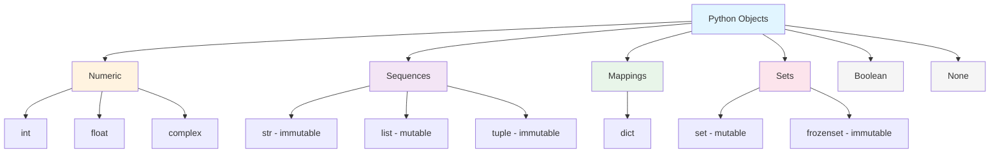

# Python Type System Reference

## AI-Relevant Type Usage

| Type | AI Use Case | Example |
|------|-------------|---------|
| `int` | Epochs, batch sizes, indices | `epochs = 100` |
| `float` | Weights, losses, learning rates | `lr = 0.001` |
| `str` | Model names, file paths, prompts | `model = "gpt-4"` |
| `list` | Datasets, features, predictions | `preds = [0.9, 0.1]` |
| `dict` | Configs, metrics, JSON data | `config = {"lr": 0.01}` |
| `tuple` | Shapes, coordinates, return values | `shape = (224, 224, 3)` |
| `set` | Vocabulary, unique labels | `vocab = {"cat", "dog"}` |
| `bool` | Flags, conditions | `use_gpu = True` |
| `None` | Missing values, uninitialized | `best_model = None` |
