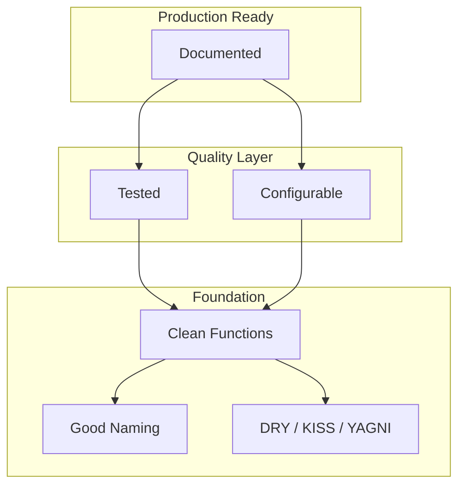

# Ch 5: Software Design & Best Practices - Introduction

**Track**: Foundation | [Try code in Playground](../../playground.md) | [Back to chapter overview](../chapter-05.md)


!!! tip "Read online or run locally"
    You can read this content here on the web. To run the code interactively,
    either use the [Playground](../../playground.md) or clone the repo and open
    `chapters/chapter-05-software-design/notebooks/01_introduction.ipynb` in Jupyter.

---

# Chapter 5: Software Design & Best Practices for AI/ML
## Notebook 01 - Introduction

Why software design matters for AI: technical debt in ML projects is real. Poor code organization leads to unmaintainable experiments, unreproducible results, and integration nightmares.

**What you'll learn:**
- Why software design matters for AI (technical debt in ML)
- Code organization: functions, modules, packages
- Naming conventions (PEP 8 for ML code)
- DRY, KISS, YAGNI principles with ML examples
- Refactoring bad ML code to good ML code

**Time estimate:** 2 hours

---
*Generated by Berta AI | Created by Luigi Pascal Rondanini*

## 1. Why Software Design Matters for AI

ML projects accumulate **technical debt** faster than traditional software:

| Problem | Impact |
|---------|--------|
| Jupyter notebooks with 1000+ lines | Unmaintainable, unreproducible |
| Hardcoded hyperparameters | Can't reproduce experiments |
| Copy-pasted preprocessing | Inconsistent behavior across scripts |
| Monolithic training scripts | Can't test or swap components |

**Good design** = reproducibility + maintainability + testability.

```python
# BAD: Everything in one cell, magic numbers, unclear names
x = [1,2,3,4,5]
y = [2.1, 4.2, 5.8, 8.1, 10.2]
n = len(x)
w, b = 0, 0
for _ in range(1000):  # What is 1000? Why?
    p = [w*xi+b for xi in x]
    e = [(p[i]-y[i]) for i in range(n)]
    dw = (2/n)*sum(e[i]*x[i] for i in range(n))
    db = (2/n)*sum(e)
    w -= 0.01*dw  # Magic number!
    b -= 0.01*db
print(w, b)
```

## 2. Code Quality Pyramid (Mermaid)



## 3. Naming Conventions (PEP 8 for ML)

| Element | Convention | Example |
|---------|------------|--------|
| Variables, functions | `snake_case` | `learning_rate`, `load_dataset()` |
| Classes | `PascalCase` | `DataLoader`, `BertModel` |
| Constants | `UPPER_SNAKE` | `MAX_EPOCHS`, `BATCH_SIZE` |
| Private | `_leading_underscore` | `_internal_helper()` |
| Booleans | `is_`, `has_` | `is_training`, `has_mask` |

```python
# GOOD: Descriptive names, constants extracted
LEARNING_RATE = 0.01
EPOCHS = 1000

def compute_mse_loss(predictions: list, targets: list) -> float:
    """Mean squared error between predictions and targets."""
    n = len(predictions)
    if n == 0:
        return 0.0
    squared_errors = [(p - t) ** 2 for p, t in zip(predictions, targets)]
    return sum(squared_errors) / n

def train_linear_regression(features: list, targets: list, lr: float, epochs: int):
    """Fit y = w*x + b using gradient descent."""
    w, b = 0.0, 0.0
    n = len(features)
    for _ in range(epochs):
        predictions = [w * x + b for x in features]
        errors = [p - t for p, t in zip(predictions, targets)]
        grad_w = (2 / n) * sum(e * x for e, x in zip(errors, features))
        grad_b = (2 / n) * sum(errors)
        w -= lr * grad_w
        b -= lr * grad_b
    return w, b

features = [1, 2, 3, 4, 5]
targets = [2.1, 4.2, 5.8, 8.1, 10.2]
w, b = train_linear_regression(features, targets, LEARNING_RATE, EPOCHS)
print(f"Trained: y = {w:.3f}*x + {b:.3f}")
```

## 4. DRY, KISS, YAGNI with ML Examples

- **DRY (Don't Repeat Yourself)**: Extract repeated preprocessing into one function.
- **KISS (Keep It Simple, Stupid)**: Prefer `sklearn.fit()` over custom training loops when sufficient.
- **YAGNI (You Ain't Gonna Need It)**: Don't build a generic pipeline until you have 2+ real use cases.

```python
# DRY violation: Same normalization in 3 places
# BAD:
# train_data = [(x - mean) / std for x in train]
# val_data   = [(x - mean) / std for x in val]
# test_data  = [(x - mean) / std for x in test]

# GOOD: One function, reuse everywhere
def normalize(values: list, mean: float, std: float) -> list:
    """Z-score normalize: (x - mean) / std."""
    if std == 0:
        return [0.0] * len(values)
    return [(x - mean) / std for x in values]

data = [1.0, 2.0, 3.0, 4.0, 5.0]
mean = sum(data) / len(data)
variance = sum((x - mean) ** 2 for x in data) / len(data)
std = variance ** 0.5

normalized = normalize(data, mean, std)
print(f"Original: {data}")
print(f"Normalized: {[round(x, 3) for x in normalized]}")
```

## 5. Clean Code Principles - SVG Diagram


## 6. Refactoring: Before & After

**Before**: Spaghetti ML script — 50 lines, no structure

```python
# BEFORE (bad): Monolithic script
import random

def bad_training_script():
    d = [[1,2],[2,4],[3,6],[4,8],[5,10]]
    X = [r[0] for r in d]
    y = [r[1] for r in d]
    w, b = 0, 0
    for i in range(500):
        preds = [w*x+b for x in X]
        errs = [p-y[j] for j,p in enumerate(preds)]
        dw = sum(e*X[j] for j,e in enumerate(errs))/len(X)
        db = sum(errs)/len(X)
        w -= 0.05*dw
        b -= 0.05*db
    return w, b

print("Before refactor:", bad_training_script())
```

**After**: Clean, testable, documented

```python
# AFTER (good): Separated concerns, clear names
from typing import List, Tuple

def load_training_data(data: List[List[float]]) -> Tuple[List[float], List[float]]:
    """Extract features (X) and targets (y) from rows."""
    features = [row[0] for row in data]
    targets = [row[1] for row in data]
    return features, targets

def gradient_descent_step(features: List[float], targets: List[float],
                          w: float, b: float) -> Tuple[float, float]:
    """One gradient descent step for MSE. Returns (grad_w, grad_b)."""
    n = len(features)
    predictions = [w * x + b for x in features]
    errors = [p - t for p, t in zip(predictions, targets)]
    grad_w = (2 / n) * sum(e * x for e, x in zip(errors, features))
    grad_b = (2 / n) * sum(errors)
    return grad_w, grad_b

def train_linear_model(features: List[float], targets: List[float],
                       learning_rate: float = 0.05, epochs: int = 500) -> Tuple[float, float]:
    """Fit y = w*x + b. Returns (w, b)."""
    w, b = 0.0, 0.0
    for _ in range(epochs):
        grad_w, grad_b = gradient_descent_step(features, targets, w, b)
        w -= learning_rate * grad_w
        b -= learning_rate * grad_b
    return w, b

data = [[1, 2], [2, 4], [3, 6], [4, 8], [5, 10]]
X, y = load_training_data(data)
w, b = train_linear_model(X, y)
print(f"After refactor: w={w:.4f}, b={b:.4f}")
```

## 7. Summary

- **Technical debt** in ML comes from notebooks-as-code, hardcoded values, and monolithic scripts.
- **PEP 8 naming**: snake_case, PascalCase, UPPER_SNAKE for constants.
- **DRY/KISS/YAGNI** reduce complexity and make code testable.
- **Refactoring**: Extract functions, name clearly, separate concerns.

Next: Design patterns for ML (Factory, Strategy, Pipeline, Observer).

---
*Generated by Berta AI | Created by Luigi Pascal Rondanini*

---

*[Back to Ch 5 overview](../chapter-05.md) | [Try in Playground](../../playground.md) | [View on GitHub](https://github.com/luigipascal/berta-chapters/tree/main/chapters/chapter-05-software-design/notebooks/01_introduction.ipynb)*