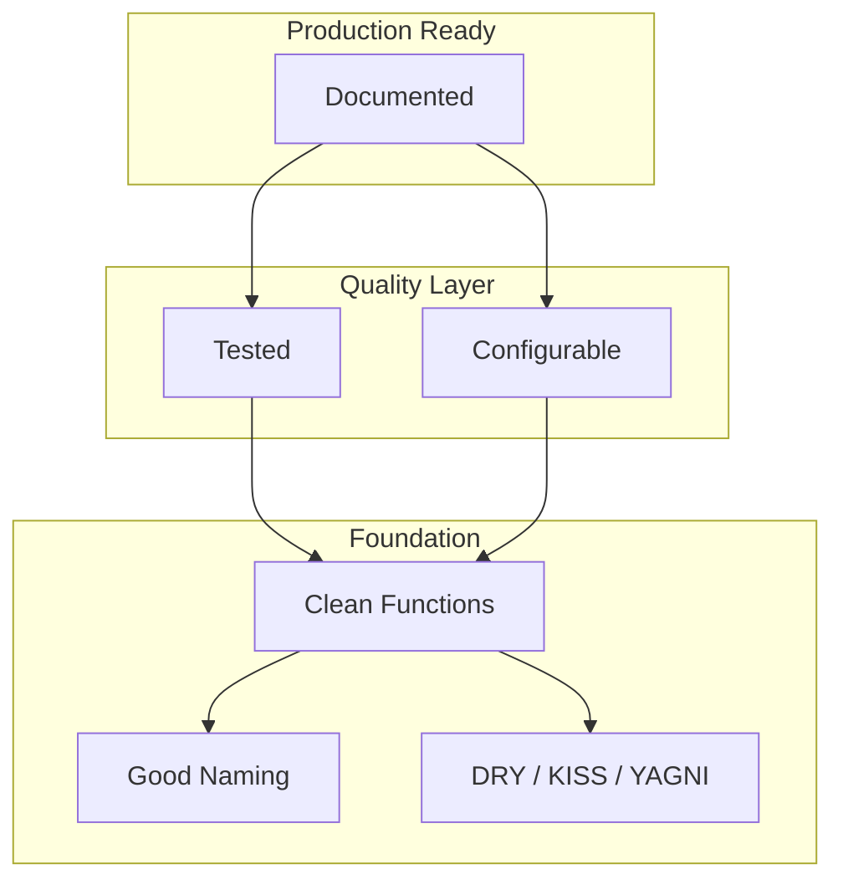

# Ch 5: Software Design & Best Practices - Introduction

**Track**: Foundation | [Try code in Playground](../../playground.md) | [Back to chapter overview](../chapter-05.md)


!!! tip "Read online or run locally"
    You can read this content here on the web. To run the code interactively,
    either use the [Playground](../../playground.md) or clone the repo and open
    `chapters/chapter-05-software-design/notebooks/01_introduction.ipynb` in Jupyter.

---

# Chapter 5: Software Design & Best Practices for AI/ML
## Notebook 01 - Introduction

**Why does code quality matter?** Messy code is like credit card debt: you borrow convenience today and pay compound interest tomorrow. Every shortcut—a magic number here, copy-pasted logic there—makes the next change harder. In ML, technical debt compounds fast: unmaintainable notebooks, unreproducible experiments, integration nightmares.

**What you'll learn:**
- Why software design matters for AI (technical debt in ML)
- Code organization: functions, modules, packages
- Naming conventions (PEP 8 for ML code)
- DRY, KISS, YAGNI principles with ML examples
- Refactoring bad ML code to good ML code

**Time estimate:** 2 hours

---
*Generated by Berta AI | Created by Luigi Pascal Rondanini*

## 1. Why Software Design Matters for AI

ML projects accumulate **technical debt** faster than traditional software: notebooks with 1000+ lines, hardcoded hyperparameters, copy-pasted preprocessing, monolithic training scripts. Good design = reproducibility + maintainability + testability.

| Problem | Impact |
|---------|--------|
| Jupyter notebooks with 1000+ lines | Unmaintainable, unreproducible |
| Hardcoded hyperparameters | Can't reproduce experiments |
| Copy-pasted preprocessing | Inconsistent behavior across scripts |
| Monolithic training scripts | Can't test or swap components |

**Good design** = reproducibility + maintainability + testability.

**The "before" code—what's wrong?** Everything in one cell. Magic numbers (1000, 0.01)—what do they mean? Unclear names (w, b, e, dw). No separation of concerns. If we want to change the learning rate, we hunt through code. If we want to reuse the loss, we can't.

```python
# BAD: Everything in one cell, magic numbers, unclear names
x = [1,2,3,4,5]
y = [2.1, 4.2, 5.8, 8.1, 10.2]
n = len(x)
w, b = 0, 0
for _ in range(1000):  # What is 1000? Why?
    p = [w*xi+b for xi in x]
    e = [(p[i]-y[i]) for i in range(n)]
    dw = (2/n)*sum(e[i]*x[i] for i in range(n))
    db = (2/n)*sum(e)
    w -= 0.01*dw  # Magic number!
    b -= 0.01*db
print(w, b)
```

**What just happened:** The code trains a linear model but gives no hint of what 1000 or 0.01 represent. A teammate reading this would have to trace through to understand. And if there's a bug in the gradient, we can't unit-test it in isolation.

## 2. Code Quality Pyramid (Mermaid)



## 3. Naming Conventions (PEP 8 for ML)

**PEP 8 is Python's style guide—like grammar rules for code.** Consistent naming helps everyone read and navigate. For ML: learning_rate not lr in public APIs, MAX_EPOCHS for constants, load_dataset() not ld().

| Element | Convention | Example |
|---------|------------|---------|
| Variables, functions | `snake_case` | `learning_rate`, `load_dataset()` |
| Classes | `PascalCase` | `DataLoader`, `BertModel` |
| Constants | `UPPER_SNAKE` | `MAX_EPOCHS`, `BATCH_SIZE` |
| Private | `_leading_underscore` | `_internal_helper()` |
| Booleans | `is_`, `has_` | `is_training`, `has_mask` |

**Good names are worth more than good comments.** A function named `compute_mse_loss` doesn't need a comment saying it computes MSE.

**The "after" code—refactored.** Constants at the top. Functions with clear names. Type hints. Each piece does one thing. We can test compute_mse_loss and train_linear_regression separately.

```python
# GOOD: Descriptive names, constants extracted
LEARNING_RATE = 0.01
EPOCHS = 1000

def compute_mse_loss(predictions: list, targets: list) -> float:
    """Mean squared error between predictions and targets."""
    n = len(predictions)
    if n == 0:
        return 0.0
    squared_errors = [(p - t) ** 2 for p, t in zip(predictions, targets)]
    return sum(squared_errors) / n

def train_linear_regression(features: list, targets: list, lr: float, epochs: int):
    """Fit y = w*x + b using gradient descent."""
    w, b = 0.0, 0.0
    n = len(features)
    for _ in range(epochs):
        predictions = [w * x + b for x in features]
        errors = [p - t for p, t in zip(predictions, targets)]
        grad_w = (2 / n) * sum(e * x for e, x in zip(errors, features))
        grad_b = (2 / n) * sum(errors)
        w -= lr * grad_w
        b -= lr * grad_b
    return w, b

features = [1, 2, 3, 4, 5]
targets = [2.1, 4.2, 5.8, 8.1, 10.2]
w, b = train_linear_regression(features, targets, LEARNING_RATE, EPOCHS)
print(f"Trained: y = {w:.3f}*x + {b:.3f}")
```

**What just happened:** Same algorithm, but now LEARNING_RATE and EPOCHS are named. The training logic is in a function we could import. The loss computation is isolated. This is testable and maintainable.

## 4. DRY, KISS, YAGNI with ML Examples

**DRY (Don't Repeat Yourself):** Extract repeated logic into one function. Before: the same normalization formula in 3 places. After: one normalize() call. If the formula changes, you fix it once.

**KISS (Keep It Simple):** Prefer sklearn.fit() over a custom training loop when it's sufficient. Over-engineering—building a generic pipeline with 10 abstraction layers before you have 2 real use cases—slows you down.

**YAGNI (You Aren't Gonna Need It):** Don't build for hypothetical futures. Premature optimization: spending a week on a "scalable" data loader when 10K rows fit in memory. Build what you need now; refactor when you have real requirements.

**DRY in action.** We had \( (x - \text{mean}) / \text{std} \) copy-pasted for train, val, test. Now: one normalize() function. We pass mean and std (computed from training data) and get normalized values.

```python
# DRY violation: Same normalization in 3 places
# BAD:
# train_data = [(x - mean) / std for x in train]
# val_data   = [(x - mean) / std for x in val]
# test_data  = [(x - mean) / std for x in test]

# GOOD: One function, reuse everywhere
def normalize(values: list, mean: float, std: float) -> list:
    """Z-score normalize: (x - mean) / std."""
    if std == 0:
        return [0.0] * len(values)
    return [(x - mean) / std for x in values]

data = [1.0, 2.0, 3.0, 4.0, 5.0]
mean = sum(data) / len(data)
variance = sum((x - mean) ** 2 for x in data) / len(data)
std = variance ** 0.5

normalized = normalize(data, mean, std)
print(f"Original: {data}")
print(f"Normalized: {[round(x, 3) for x in normalized]}")
```

**What just happened:** One function, reused. The Z-score formula is in one place. If we later switch to min-max scaling, we change one function. Try it yourself: add a min_max_normalize() and compare.

## 5. Clean Code Principles - SVG Diagram


## 6. Refactoring: Before & After

**Before**: Spaghetti ML script—50 lines, no structure. Data loading, training loop, and output all mixed. Unclear variable names. No way to test pieces in isolation. Magic numbers throughout.

**After**: Clean, testable, documented. Each function has a single responsibility. We can unit-test load_training_data, gradient_descent_step, and train_linear_model separately.

**Before refactoring.** One function does everything: builds data, trains, returns. We can't test the gradient step. We can't swap in different data. The magic numbers 500 and 0.05 are unexplained.

```python
# BEFORE (bad): Monolithic script
import random

def bad_training_script():
    d = [[1,2],[2,4],[3,6],[4,8],[5,10]]
    X = [r[0] for r in d]
    y = [r[1] for r in d]
    w, b = 0, 0
    for i in range(500):
        preds = [w*x+b for x in X]
        errs = [p-y[j] for j,p in enumerate(preds)]
        dw = sum(e*X[j] for j,e in enumerate(errs))/len(X)
        db = sum(errs)/len(X)
        w -= 0.05*dw
        b -= 0.05*db
    return w, b

print("Before refactor:", bad_training_script())
```

**What just happened:** The bad script works—it produces w and b. But it's a black box. If the gradient is wrong, we'd have to add print statements and hope. No isolation.

**After refactoring.** We've extracted: load_training_data, gradient_descent_step, train_linear_model. Each has a docstring. Parameters are explicit. We could now write test_gradient_descent_step() with known inputs and expected outputs.

```python
# AFTER (good): Separated concerns, clear names
from typing import List, Tuple

def load_training_data(data: List[List[float]]) -> Tuple[List[float], List[float]]:
    """Extract features (X) and targets (y) from rows."""
    features = [row[0] for row in data]
    targets = [row[1] for row in data]
    return features, targets

def gradient_descent_step(features: List[float], targets: List[float],
                          w: float, b: float) -> Tuple[float, float]:
    """One gradient descent step for MSE. Returns (grad_w, grad_b)."""
    n = len(features)
    predictions = [w * x + b for x in features]
    errors = [p - t for p, t in zip(predictions, targets)]
    grad_w = (2 / n) * sum(e * x for e, x in zip(errors, features))
    grad_b = (2 / n) * sum(errors)
    return grad_w, grad_b

def train_linear_model(features: List[float], targets: List[float],
                       learning_rate: float = 0.05, epochs: int = 500) -> Tuple[float, float]:
    """Fit y = w*x + b. Returns (w, b)."""
    w, b = 0.0, 0.0
    for _ in range(epochs):
        grad_w, grad_b = gradient_descent_step(features, targets, w, b)
        w -= learning_rate * grad_w
        b -= learning_rate * grad_b
    return w, b

data = [[1, 2], [2, 4], [3, 6], [4, 8], [5, 10]]
X, y = load_training_data(data)
w, b = train_linear_model(X, y)
print(f"After refactor: w={w:.4f}, b={b:.4f}")
```

**What just happened:** Same output, better structure. The training loop calls gradient_descent_step—which we could unit-test with hand-checked gradients. The pipeline is clear: load → train → done.

## 7. Summary

- **Technical debt** in ML: notebooks-as-code, hardcoded values, monolithic scripts. Messy code is like credit card debt.
- **PEP 8 naming**: snake_case, PascalCase, UPPER_SNAKE. Good names > good comments.
- **DRY/KISS/YAGNI**: Don't repeat, keep it simple, build only what you need. They reduce complexity and make code testable.
- **Refactoring**: Extract functions, name clearly, separate concerns. Before/after shows the value.

Next: Design patterns for ML (Factory, Strategy, Pipeline, Observer).

---
*Generated by Berta AI | Created by Luigi Pascal Rondanini*

---

*[Back to Ch 5 overview](../chapter-05.md) | [Try in Playground](../../playground.md) | [View on GitHub](https://github.com/luigipascal/berta-chapters/tree/main/chapters/chapter-05-software-design/notebooks/01_introduction.ipynb)*