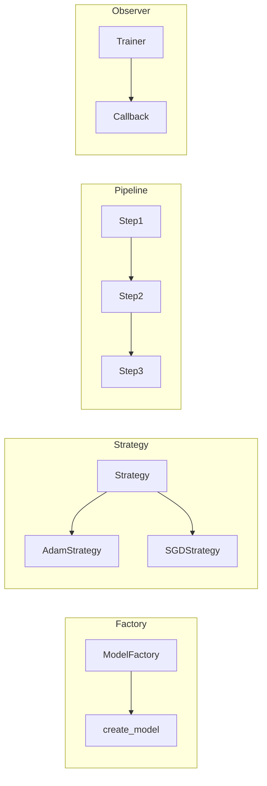

# Ch 5: Software Design & Best Practices - Intermediate

**Track**: Foundation | [Try code in Playground](../../playground.md) | [Back to chapter overview](../chapter-05.md)


!!! tip "Read online or run locally"
    You can read this content here on the web. To run the code interactively,
    either use the [Playground](../../playground.md) or clone the repo and open
    `chapters/chapter-05-software-design/notebooks/02_intermediate.ipynb` in Jupyter.

---

# Chapter 5: Software Design & Best Practices
## Notebook 02 - Intermediate

Design patterns make ML code flexible and testable. Testing ensures your preprocessing and training logic are correct before you scale experiments.

**What you'll learn:**
- Design patterns for ML: Factory, Strategy, Pipeline, Observer
- unittest and pytest for ML code
- Writing testable ML code (dependency injection)
- Configuration management (YAML/JSON vs hardcoded)

**Why design patterns?** As your ML project grows, you will add new models, try new optimizers, and change preprocessing. Without patterns, each change touches core logic. With patterns, you add new pieces without breaking old ones. Tests become possible because you can inject mocks. This notebook shows four patterns used everywhere in production ML.

**Time estimate:** 2 hours

---
*Generated by Berta AI | Created by Luigi Pascal Rondanini*

## 1. Design Patterns for ML

Design patterns are reusable solutions to common problems. For ML, we use them to avoid if/else chains, swap algorithms without rewriting callers, and structure data flows. They make code flexible: add a new model or optimizer without touching the training loop. They also make code testable: mock a strategy or factory in unit tests.




## 2. Factory Pattern — Model Creation

**The problem:** You need different models (linear, MLP, BERT) but don't want if/else chains everywhere. Every time you add a model, you'd have to touch the training script. The Factory pattern centralizes model creation: you pass a name or config, and get the right model back. Add a new model? Register it; no changes to the training pipeline.

**The solution:** ModelFactory maintains a registry of name to class. We register each model with a decorator. create("linear") returns LinearModel; create("mlp") returns MLPModel. The training code never sees the if/else. When you add BERT or a custom architecture, you define it, register it, and the rest of the pipeline works without modification. This is how frameworks like Hugging Face and scikit-learn manage model variety.

```python
from typing import Any, Dict

class ModelFactory:
    """Create models by name. Extensible: add new models without touching training code."""
    _registry: Dict[str, type] = {}

    @classmethod
    def register(cls, name: str):
        def decorator(model_class):
            cls._registry[name] = model_class
            return model_class
        return decorator

    @classmethod
    def create(cls, name: str, **kwargs) -> Any:
        if name not in cls._registry:
            raise ValueError(f"Unknown model: {name}. Available: {list(cls._registry.keys())}")
        return cls._registry[name](**kwargs)

# Define simple model classes
class LinearModel:
    def __init__(self, in_features: int = 10):
        self.in_features = in_features
    def __repr__(self): return f"LinearModel(in={self.in_features})"

class MLPModel:
    def __init__(self, layers: list = None):
        self.layers = layers or [64, 32]
    def __repr__(self): return f"MLPModel(layers={self.layers})"

ModelFactory.register("linear")(LinearModel)
ModelFactory.register("mlp")(MLPModel)

# Use the factory
model1 = ModelFactory.create("linear", in_features=20)
model2 = ModelFactory.create("mlp", layers=[128, 64, 32])
print("Factory:", model1, model2)
```

**What just happened:** We registered LinearModel and MLPModel by name. ModelFactory.create('linear', in_features=20) returns a LinearModel. We can add a new model by defining it and registering—no changes to code that uses the factory.

**Common mistake:** Creating models with a long if/elif chain. Every new model means editing the core logic. The Factory keeps model creation in one place; the rest of the code stays clean.

## 3. Strategy Pattern — Algorithm Selection

**The problem:** You want to swap algorithms (SGD, Adam, Momentum) without changing the code that uses them. The training loop shouldn't care which optimizer it's using—it just calls "take a step." The Strategy pattern: define an interface (apply_step), implement it for each algorithm, inject the strategy at runtime.

**The solution:** OptimizerStrategy is the interface. SGDStrategy and MomentumStrategy implement it. The Trainer takes a strategy and calls apply_step. Swap strategies without touching Trainer.

```python
from abc import ABC, abstractmethod

class OptimizerStrategy(ABC):
    @abstractmethod
    def get_name(self) -> str:
        pass

    @abstractmethod
    def apply_step(self, param: float, grad: float, lr: float) -> float:
        """Apply one optimization step. Return updated param."""
        pass

class SGDStrategy(OptimizerStrategy):
    def get_name(self): return "SGD"
    def apply_step(self, param, grad, lr):
        return param - lr * grad

class MomentumStrategy(OptimizerStrategy):
    def __init__(self, momentum: float = 0.9):
        self.momentum = momentum
        self.velocity = 0.0
    def get_name(self): return "Momentum"
    def apply_step(self, param, grad, lr):
        self.velocity = self.momentum * self.velocity + grad
        return param - lr * self.velocity

class Trainer:
    def __init__(self, optimizer: OptimizerStrategy, learning_rate: float = 0.01):
        self.optimizer = optimizer
        self.lr = learning_rate

    def train_step(self, param: float, grad: float) -> float:
        return self.optimizer.apply_step(param, grad, self.lr)

# Swap strategies without changing Trainer
sgd_trainer = Trainer(SGDStrategy(), 0.01)
mom_trainer = Trainer(MomentumStrategy(0.9), 0.01)
param, grad = 1.0, 0.5
print(f"SGD:       {param} -> {sgd_trainer.train_step(param, grad):.4f}")
print(f"Momentum:  {param} -> {mom_trainer.train_step(param, grad):.4f}")
```

**What just happened:** We passed SGDStrategy and MomentumStrategy to the same Trainer. Same train_step call, different behavior. SGD: param - lr*grad. Momentum: uses velocity. The trainer doesn't know or care.

**Try it yourself:** Create an AdamStrategy that implements apply_step with adaptive learning rates. Register it and pass it to the Trainer. No changes to Trainer needed.

**Common mistake:** Hardcoding the optimizer in the training loop. If you write the update rule directly inside the loop, swapping to Adam requires editing the core logic. Strategy avoids that.

## 4. Pipeline Pattern — Data Processing

**The problem:** Data flows through a series of transformations—load → normalize → clip → featurize. Like an assembly line. You want to add or remove steps without rewriting the whole flow. The Pipeline pattern: a list of steps, each receiving the output of the previous.

**The solution:** A Pipeline holds a list of callables. fit_transform runs each in order; transform does the same (for inference, without fitting). Steps can be functions or objects with fit_transform/transform.

```python
from typing import List, Callable

class Pipeline:
    """Chain transformations. Each step receives output of previous."""
    def __init__(self, steps: List[Callable]):
        self.steps = steps

    def fit_transform(self, data):
        result = data
        for step in self.steps:
            if hasattr(step, 'fit_transform'):
                result = step.fit_transform(result)
            else:
                result = step(result)
        return result

    def transform(self, data):
        result = data
        for step in self.steps:
            if hasattr(step, 'transform'):
                result = step.transform(result)
            else:
                result = step(result)
        return result

# Simple steps
def normalize_step(data: List[float]) -> List[float]:
    mean = sum(data) / len(data)
    std = (sum((x - mean)**2 for x in data) / len(data)) ** 0.5
    return [(x - mean) / std if std > 0 else 0 for x in data]

def clip_step(data: List[float], low=-3, high=3) -> List[float]:
    return [max(low, min(high, x)) for x in data]

pipe = Pipeline([normalize_step, lambda d: clip_step(d)])
raw = [1.0, 2.0, 3.0, 4.0, 100.0]  # outlier at end
processed = pipe.fit_transform(raw)
print("Pipeline:", raw, "->", [round(x, 2) for x in processed])
```

**What just happened:** We passed [normalize_step, clip_step] to the pipeline. Raw data [1,2,3,4,100] → normalized → clipped. The outlier 100 gets pulled back. Easy to add new steps (e.g., log transform).

**Try it yourself:** Add a step that squares the values. Insert it between normalize and clip. The pipeline pattern makes such changes trivial.

## 5. Observer Pattern — Training Callbacks

**The problem:** Multiple things need to know when something happens during training. Logging wants to print every 10 epochs. Early stopping wants to check if loss improved. Checkpointing wants to save. The training loop would become a mess of "if logging: ..., if early_stop: ...". The Observer pattern: the trainer notifies a list of callbacks; each callback does its own thing.

**The solution:** Callbacks subscribe to events (on_epoch_end). The TrainingLoop iterates and calls each callback. LoggingCallback prints. EarlyStoppingCallback tracks loss and sets should_stop. The trainer checks and returns early. Add new behavior = add new callback.

Frameworks like Keras and PyTorch Lightning use this pattern everywhere. Every time you add model checkpointing, TensorBoard logging, or learning rate scheduling, you are adding a callback. The training loop stays simple; callbacks handle the complexity.

```python
from abc import ABC, abstractmethod

class Callback(ABC):
    @abstractmethod
    def on_epoch_end(self, epoch: int, loss: float, **kwargs) -> None:
        pass

class LoggingCallback(Callback):
    def on_epoch_end(self, epoch, loss, **kwargs):
        if epoch % 10 == 0:
            print(f"  Epoch {epoch}: loss={loss:.4f}")

class EarlyStoppingCallback(Callback):
    def __init__(self, patience: int = 3, min_delta: float = 1e-4):
        self.patience = patience
        self.min_delta = min_delta
        self.best_loss = float('inf')
        self.no_improve = 0
        self.should_stop = False

    def on_epoch_end(self, epoch, loss, **kwargs):
        if loss < self.best_loss - self.min_delta:
            self.best_loss = loss
            self.no_improve = 0
        else:
            self.no_improve += 1
        if self.no_improve >= self.patience:
            self.should_stop = True
            print(f"  Early stopping at epoch {epoch}")

class TrainingLoop:
    def __init__(self, callbacks: list = None):
        self.callbacks = callbacks or []

    def fit(self, epochs: int = 50):
        loss = 1.0
        for epoch in range(epochs):
            loss *= 0.95  # Simulate decreasing loss
            for cb in self.callbacks:
                cb.on_epoch_end(epoch, loss)
                if hasattr(cb, 'should_stop') and cb.should_stop:
                    return
        print("Training complete")

loop = TrainingLoop([LoggingCallback(), EarlyStoppingCallback(patience=5)])
loop.fit(epochs=100)
```

**What just happened:** We ran a simulated training loop with LoggingCallback and EarlyStoppingCallback. Every epoch, both got notified. EarlyStoppingCallback stopped when loss didn't improve for 5 epochs. The loop itself has no logging or early-stopping logic—it's all in callbacks.

## 6. Testing ML Code — unittest and pytest

**Tests catch bugs before your users do.** A single failing test can save hours of debugging. In ML, we test preprocessing (deterministic), loss functions (known inputs, expected outputs), and data loading (with mock or small fixtures). We avoid testing randomness directly—use fixed seeds when needed. When you change preprocessing, a test can verify the output is still correct. When you refactor, tests tell you if you broke something. For ML: test the deterministic parts—normalization, loss functions, data loading. Use fixed seeds for randomness. Mock heavy dependencies (don't load 10GB in tests).

**Why tests matter:** Without tests, every change is a gamble. Thinking you did not break anything is not a strategy. With tests, you get immediate feedback. A test that fails tells you exactly what broke. In ML, test the deterministic parts: preprocessing, loss functions, data loading. Use fixed seeds for anything random.

**A testable function.** normalize_features is pure: same inputs → same outputs. We can assert exact expected values. No randomness, no I/O.

```python
def normalize_features(values: list, mean: float, std: float) -> list:
    """Z-score normalize. Testable: deterministic output."""
    if std == 0:
        return [0.0] * len(values)
    return [(x - mean) / std for x in values]

# pytest-style test (run with: pytest -v notebook or copy to test file)
def test_normalize_features():
    assert normalize_features([1, 2, 3], 2, 1) == [-1, 0, 1]
    assert normalize_features([0, 0, 0], 0, 1) == [0, 0, 0]
    assert normalize_features([5], 5, 0) == [0.0]  # std=0 edge case

test_normalize_features()
print("Tests passed!")
```

**What just happened:** test_normalize_features runs three assertions. [1,2,3] with mean=2, std=1 → [-1,0,1]. Edge case std=0 → [0,0,0]. If someone changes the formula and breaks it, this test fails. Try it: change the formula and run again.

**Dependency injection.** train_with_dependency_injection takes a data_loader as an argument. In production we pass a real loader. In tests we pass FakeDataLoader that returns fixed data. The training logic gets tested without loading real data. The key insight: any external dependency (data, API, files) should be injectable so tests can substitute mocks. Hardcoding dependencies makes testing impossible.

```python
def train_with_dependency_injection(
    data_loader,  # Inject: easy to replace with mock
    model,
    epochs: int = 10
):
    """Testable: inject data_loader so we can pass fake data in tests."""
    X, y = data_loader.load()
    for _ in range(epochs):
        # training logic...
        pass
    return model

# In tests: pass a FakeDataLoader that returns fixed data
class FakeDataLoader:
    def load(self):
        return [1, 2, 3], [2, 4, 6]

print("Dependency injection enables testing with fake data")
```

**What just happened:** We showed the pattern. In a real test file, we'd call train_with_dependency_injection(FakeDataLoader(), model) and assert something about the result. The key: inject dependencies so tests can substitute mocks.

## 7. Configuration Management

**Hardcoded values are time bombs.** Learning rate 0.001 in line 47—to change it you edit code, risk introducing bugs, and lose the old value. A config file separates what (hyperparameters) from how (code). Change the config, rerun—reproducible. Example: you had lr=0.001 and get bad results. You try 0.0001. Without config, you edit the script. With config, you run with config_v2.yaml and keep both for comparison.

**JSON config.** We define a dict with model, learning_rate, epochs, batch_size. We save it to a file. The training script loads it. One source of truth. Reproducible runs: commit the config with the code.

```python
import json

# config.json or config.yaml
config = {
    "model": "linear",
    "learning_rate": 0.001,
    "epochs": 100,
    "batch_size": 32
}

# Save for reproducibility
with open("/tmp/sample_config.json", "w") as f:
    json.dump(config, f, indent=2)

# Load in training script
with open("/tmp/sample_config.json") as f:
    loaded = json.load(f)

print("Config:", loaded)
print("LR from config:", loaded["learning_rate"])
```

**What just happened:** We wrote config to /tmp and read it back. In production, the training script would load config at startup and use the learning_rate key instead of a magic number. Try adding a new key and using it.

```python
try:
    import yaml
    yaml_config = """
model: mlp
learning_rate: 0.001
epochs: 100
layers: [64, 32, 16]
"""
    cfg = yaml.safe_load(yaml_config)
    print("YAML config:", cfg)
except ImportError:
    print("Install pyyaml for YAML support: pip install pyyaml")
```

**YAML** is more readable for nested config. Many ML tools (Hydra, MLflow) use YAML. Same idea: externalize configuration.

**Try it yourself:** Create a config file with nested structure (e.g., model.encoder.layers as a list). Load it and access nested keys. This mirrors real ML configs.

**Common mistake:** Mixing config and code. Hyperparameters belong in config. Logic belongs in code. If you find yourself editing Python to change a learning rate, you have violated this.

**Quick reference:** Factory = create by name. Strategy = swap algorithm. Pipeline = chain transforms. Observer = callbacks. Testing = dependency injection. Config = external YAML/JSON. Master these six and your ML code will scale.

## 8. Summary

- **Factory**: Create models by name/config. Add new models without touching training code.
- **Strategy**: Swap optimizers, preprocessing, loss functions. Same interface, different implementations.
- **Pipeline**: Chain data transforms. Assembly line for data.
- **Observer**: Callbacks for logging, early stopping. Trainer notifies; callbacks react.
- **Testing**: Test deterministic logic. Use dependency injection for testability.
- **Config**: YAML/JSON for hyperparameters. Reproducibility and flexibility.

**Key takeaway:** Design patterns are not over-engineering—they are the minimal structure that makes ML code maintainable. Start with one pattern (e.g., Factory for models) and add others as complexity grows. The goal is flexibility: new models, new optimizers, new preprocessing—all without rewriting the core. When someone asks "how do I add a new model?" the answer should be "register it"—not "edit the training loop."

Next: Project structure, docs, and capstone refactor.

---
*Generated by Berta AI | Created by Luigi Pascal Rondanini*

---

*[Back to Ch 5 overview](../chapter-05.md) | [Try in Playground](../../playground.md) | [View on GitHub](https://github.com/luigipascal/berta-chapters/tree/main/chapters/chapter-05-software-design/notebooks/02_intermediate.ipynb)*