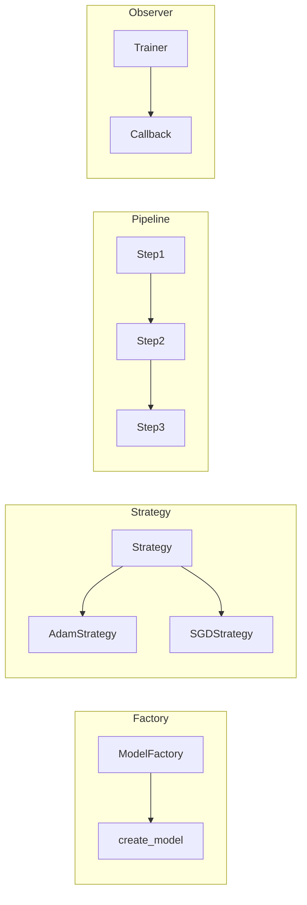

# Ch 5: Software Design & Best Practices - Intermediate

**Track**: Foundation | [Try code in Playground](../../playground.md) | [Back to chapter overview](../chapter-05.md)


!!! tip "Read online or run locally"
    You can read this content here on the web. To run the code interactively,
    either use the [Playground](../../playground.md) or clone the repo and open
    `chapters/chapter-05-software-design/notebooks/02_intermediate.ipynb` in Jupyter.

---

# Chapter 5: Software Design & Best Practices
## Notebook 02 - Intermediate

Design patterns make ML code flexible and testable. Testing ensures your preprocessing and training logic are correct before you scale experiments.

**What you'll learn:**
- Design patterns for ML: Factory, Strategy, Pipeline, Observer
- unittest and pytest for ML code
- Writing testable ML code (dependency injection)
- Configuration management (YAML/JSON vs hardcoded)

**Time estimate:** 2 hours

---
*Generated by Berta AI | Created by Luigi Pascal Rondanini*

## 1. Design Patterns for ML




## 2. Factory Pattern — Model Creation

Centralize model instantiation. Switch models without changing the training pipeline.

```python
from typing import Any, Dict

class ModelFactory:
    """Create models by name. Extensible: add new models without touching training code."""
    _registry: Dict[str, type] = {}

    @classmethod
    def register(cls, name: str):
        def decorator(model_class):
            cls._registry[name] = model_class
            return model_class
        return decorator

    @classmethod
    def create(cls, name: str, **kwargs) -> Any:
        if name not in cls._registry:
            raise ValueError(f"Unknown model: {name}. Available: {list(cls._registry.keys())}")
        return cls._registry[name](**kwargs)

# Define simple model classes
class LinearModel:
    def __init__(self, in_features: int = 10):
        self.in_features = in_features
    def __repr__(self): return f"LinearModel(in={self.in_features})"

class MLPModel:
    def __init__(self, layers: list = None):
        self.layers = layers or [64, 32]
    def __repr__(self): return f"MLPModel(layers={self.layers})"

ModelFactory.register("linear")(LinearModel)
ModelFactory.register("mlp")(MLPModel)

# Use the factory
model1 = ModelFactory.create("linear", in_features=20)
model2 = ModelFactory.create("mlp", layers=[128, 64, 32])
print("Factory:", model1, model2)
```

## 3. Strategy Pattern — Algorithm Selection

Swap algorithms at runtime. Same interface, different behavior.

```python
from abc import ABC, abstractmethod

class OptimizerStrategy(ABC):
    @abstractmethod
    def get_name(self) -> str:
        pass

    @abstractmethod
    def apply_step(self, param: float, grad: float, lr: float) -> float:
        """Apply one optimization step. Return updated param."""
        pass

class SGDStrategy(OptimizerStrategy):
    def get_name(self): return "SGD"
    def apply_step(self, param, grad, lr):
        return param - lr * grad

class MomentumStrategy(OptimizerStrategy):
    def __init__(self, momentum: float = 0.9):
        self.momentum = momentum
        self.velocity = 0.0
    def get_name(self): return "Momentum"
    def apply_step(self, param, grad, lr):
        self.velocity = self.momentum * self.velocity + grad
        return param - lr * self.velocity

class Trainer:
    def __init__(self, optimizer: OptimizerStrategy, learning_rate: float = 0.01):
        self.optimizer = optimizer
        self.lr = learning_rate

    def train_step(self, param: float, grad: float) -> float:
        return self.optimizer.apply_step(param, grad, self.lr)

# Swap strategies without changing Trainer
sgd_trainer = Trainer(SGDStrategy(), 0.01)
mom_trainer = Trainer(MomentumStrategy(0.9), 0.01)
param, grad = 1.0, 0.5
print(f"SGD:       {param} -> {sgd_trainer.train_step(param, grad):.4f}")
print(f"Momentum:  {param} -> {mom_trainer.train_step(param, grad):.4f}")
```

## 4. Pipeline Pattern — Data Processing

Chain transforms: load → preprocess → featurize.

```python
from typing import List, Callable

class Pipeline:
    """Chain transformations. Each step receives output of previous."""
    def __init__(self, steps: List[Callable]):
        self.steps = steps

    def fit_transform(self, data):
        result = data
        for step in self.steps:
            if hasattr(step, 'fit_transform'):
                result = step.fit_transform(result)
            else:
                result = step(result)
        return result

    def transform(self, data):
        result = data
        for step in self.steps:
            if hasattr(step, 'transform'):
                result = step.transform(result)
            else:
                result = step(result)
        return result

# Simple steps
def normalize_step(data: List[float]) -> List[float]:
    mean = sum(data) / len(data)
    std = (sum((x - mean)**2 for x in data) / len(data)) ** 0.5
    return [(x - mean) / std if std > 0 else 0 for x in data]

def clip_step(data: List[float], low=-3, high=3) -> List[float]:
    return [max(low, min(high, x)) for x in data]

pipe = Pipeline([normalize_step, lambda d: clip_step(d)])
raw = [1.0, 2.0, 3.0, 4.0, 100.0]  # outlier at end
processed = pipe.fit_transform(raw)
print("Pipeline:", raw, "->", [round(x, 2) for x in processed])
```

## 5. Observer Pattern — Training Callbacks

Subscribe to training events: epoch end, batch, early stopping.

```python
from abc import ABC, abstractmethod

class Callback(ABC):
    @abstractmethod
    def on_epoch_end(self, epoch: int, loss: float, **kwargs) -> None:
        pass

class LoggingCallback(Callback):
    def on_epoch_end(self, epoch, loss, **kwargs):
        if epoch % 10 == 0:
            print(f"  Epoch {epoch}: loss={loss:.4f}")

class EarlyStoppingCallback(Callback):
    def __init__(self, patience: int = 3, min_delta: float = 1e-4):
        self.patience = patience
        self.min_delta = min_delta
        self.best_loss = float('inf')
        self.no_improve = 0
        self.should_stop = False

    def on_epoch_end(self, epoch, loss, **kwargs):
        if loss < self.best_loss - self.min_delta:
            self.best_loss = loss
            self.no_improve = 0
        else:
            self.no_improve += 1
        if self.no_improve >= self.patience:
            self.should_stop = True
            print(f"  Early stopping at epoch {epoch}")

class TrainingLoop:
    def __init__(self, callbacks: list = None):
        self.callbacks = callbacks or []

    def fit(self, epochs: int = 50):
        loss = 1.0
        for epoch in range(epochs):
            loss *= 0.95  # Simulate decreasing loss
            for cb in self.callbacks:
                cb.on_epoch_end(epoch, loss)
                if hasattr(cb, 'should_stop') and cb.should_stop:
                    return
        print("Training complete")

loop = TrainingLoop([LoggingCallback(), EarlyStoppingCallback(patience=5)])
loop.fit(epochs=100)
```

## 6. Testing ML Code — unittest and pytest

Test preprocessing, not randomness. Use fixed seeds. Mock heavy dependencies.

```python
def normalize_features(values: list, mean: float, std: float) -> list:
    """Z-score normalize. Testable: deterministic output."""
    if std == 0:
        return [0.0] * len(values)
    return [(x - mean) / std for x in values]

# pytest-style test (run with: pytest -v notebook or copy to test file)
def test_normalize_features():
    assert normalize_features([1, 2, 3], 2, 1) == [-1, 0, 1]
    assert normalize_features([0, 0, 0], 0, 1) == [0, 0, 0]
    assert normalize_features([5], 5, 0) == [0.0]  # std=0 edge case

test_normalize_features()
print("Tests passed!")
```

```python
def train_with_dependency_injection(
    data_loader,  # Inject: easy to replace with mock
    model,
    epochs: int = 10
):
    """Testable: inject data_loader so we can pass fake data in tests."""
    X, y = data_loader.load()
    for _ in range(epochs):
        # training logic...
        pass
    return model

# In tests: pass a FakeDataLoader that returns fixed data
class FakeDataLoader:
    def load(self):
        return [1, 2, 3], [2, 4, 6]

print("Dependency injection enables testing with fake data")
```

## 7. Configuration Management

**Bad**: Hyperparameters scattered in code. **Good**: Single config file (YAML/JSON).

```python
import json

# config.json or config.yaml
config = {
    "model": "linear",
    "learning_rate": 0.001,
    "epochs": 100,
    "batch_size": 32
}

# Save for reproducibility
with open("/tmp/sample_config.json", "w") as f:
    json.dump(config, f, indent=2)

# Load in training script
with open("/tmp/sample_config.json") as f:
    loaded = json.load(f)

print("Config:", loaded)
print("LR from config:", loaded["learning_rate"])
```

```python
try:
    import yaml
    yaml_config = """
model: mlp
learning_rate: 0.001
epochs: 100
layers: [64, 32, 16]
"""
    cfg = yaml.safe_load(yaml_config)
    print("YAML config:", cfg)
except ImportError:
    print("Install pyyaml for YAML support: pip install pyyaml")
```

## 8. Summary

- **Factory**: Create models by name/config.
- **Strategy**: Swap optimizers, preprocessing, loss functions.
- **Pipeline**: Chain data transforms.
- **Observer**: Callbacks for logging, early stopping.
- **Testing**: Normalize, deterministic logic, dependency injection.
- **Config**: YAML/JSON for reproducibility.

Next: Project structure, docs, and capstone refactor.

---
*Generated by Berta AI | Created by Luigi Pascal Rondanini*

---

*[Back to Ch 5 overview](../chapter-05.md) | [Try in Playground](../../playground.md) | [View on GitHub](https://github.com/luigipascal/berta-chapters/tree/main/chapters/chapter-05-software-design/notebooks/02_intermediate.ipynb)*