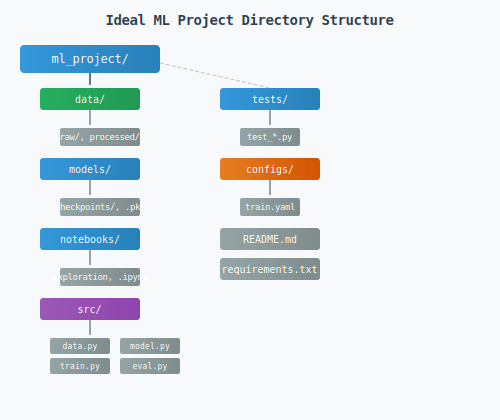
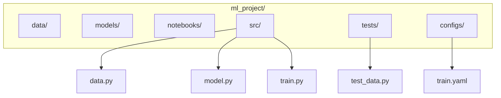

# Ch 5: Software Design & Best Practices - Advanced

**Track**: Foundation | [Try code in Playground](../../playground.md) | [Back to chapter overview](../chapter-05.md)


!!! tip "Read online or run locally"
    You can read this content here on the web. To run the code interactively,
    either use the [Playground](../../playground.md) or clone the repo and open
    `chapters/chapter-05-software-design/notebooks/03_advanced.ipynb` in Jupyter.

---

# Chapter 5: Software Design & Best Practices
## Notebook 03 - Advanced

Structure production-ready ML projects. Version control, documentation, error handling, and a capstone refactor.

**What you'll learn:**
- Project structure for ML projects (full walkthrough)
- Version control best practices (branching for experiments)
- Documentation: docstrings, type hints, README patterns
- Error handling and logging in ML pipelines
- Capstone: refactor a messy ML script into a well-structured project

**From prototype to production:** A notebook with 50 cells might work for you today. But when you need to hand off to a teammate, deploy to a server, or reproduce results in six months, structure matters. This notebook shows the conventions used in production ML codebases: clear folders, versioned experiments, documented functions, and graceful error handling.

**Time estimate:** 2 hours

---
*Generated by Berta AI | Created by Luigi Pascal Rondanini*

## 1. ML Project Structure

**Each folder has a purpose.** data/ holds raw and processed data—never commit raw data to git, use DVC if needed. models/ holds checkpoints and saved models. notebooks/ for exploration and one-off experiments—not production code. src/ is the real code: data.py (loaders, preprocessing), model.py (model definitions), train.py (training loop), eval.py (evaluation). tests/ for unit and integration tests. configs/ for YAML/JSON configs. README tells people how to run things. This structure scales from a weekend project to a team codebase.





**Folder purposes:**
- **data/**: Raw and processed data. Keep raw immutable; processing scripts write to processed/. Never edit raw data—treat it as read-only.
- **models/**: Saved checkpoints, .pkl files. Do not commit large files to git; use DVC or a model registry.
- **notebooks/**: Exploration, visualization. Prototype here; move stable code to src/. Notebooks are for discovery, not production.
- **src/**: Production code. data.py, model.py, train.py, eval.py. Importable, testable. This is what gets deployed.
- **tests/**: test_data.py, test_model.py. Mirror src/ structure. Run tests before every commit.
- **configs/**: train.yaml, eval.yaml. Hyperparameters and paths. One config per experiment.
- **README.md**: How to install, run, reproduce. Critical for collaboration. Assume the reader has never seen the project.

```python
# Typical structure (conceptual)
structure = """
ml_project/
├── data/           # raw/, processed/
├── models/         # checkpoints, .pkl
├── notebooks/      # exploration, experiments
├── src/
│   ├── data.py     # DataLoader, preprocessing
│   ├── model.py    # Model definitions
│   ├── train.py    # Trainer
│   └── eval.py     # Evaluator
├── tests/
│   └── test_*.py
├── configs/        # train.yaml, eval.yaml
├── README.md
└── requirements.txt
"""
print(structure)
```

**What just happened:** We printed the conceptual structure. In a real project, you would create these folders and add __init__.py in src/ for package imports.

## 2. Version Control Best Practices

**Each experiment gets its own branch.** experiment/bert-v2, experiment/lr-0.001. When you switch ideas, you switch branches—no mixing. This keeps the main branch stable while you iterate. Commit config and code together so a checkout gives you a reproducible run: someone else (or you in six months) can reproduce the exact experiment. Do not commit data/ or models/—use .gitignore. For large files, use DVC. Tag releases: v1.0-model-bert when you deploy so you can always find the exact code that produced a result.

| Practice | Purpose |
|----------|---------|
| Branch per experiment | `experiment/bert-v2`, `experiment/lr-0.001` |
| Commit config + code together | Reproducible runs |
| `.gitignore` large files | Don't commit data/, models/ (use DVC if needed) |
| Tag releases | `v1.0-model-bert` for deployments |

**Typical .gitignore for ML.** Exclude data, model weights, environments, cache. Keep the repo small and fast.

```python
# .gitignore for ML projects
gitignore = """
# Data (use DVC for versioning)
data/raw/
data/processed/
models/*.pkl
models/checkpoints/

# Environments
.venv/
venv/
__pycache__/
*.pyc

# Jupyter
.ipynb_checkpoints/
"""
print(gitignore)
```

**What just happened:** We showed a sensible .gitignore. data/raw/, models/*.pkl, venv/, __pycache__—all excluded. Add project-specific paths as needed.

## 3. Documentation: Docstrings & Type Hints

**Docstrings:** Purpose, args, returns, raises. Bad docstring: Load data. Good docstring: Load data from path. Args: path (CSV or JSON), normalize (if True, z-score). Returns: (features, targets). Raises: FileNotFoundError if path missing. The difference: a reader knows what to pass, what to expect, and what can go wrong.

**Type hints** are like labels on containers. They tell you and the IDE exactly what goes in and out. Enables mypy, autocomplete, and fewer runtime errors.

```python
from typing import List, Tuple, Optional

def load_and_preprocess(
    path: str,
    normalize: bool = True,
    target_column: Optional[str] = None
) -> Tuple[List[List[float]], List[float]]:
    """
    Load data from path and optionally normalize features.

    Args:
        path: Path to CSV or JSON file.
        normalize: If True, z-score normalize features.
        target_column: Name of target column. If None, last column used.

    Returns:
        Tuple of (features, targets). Each is a list of lists / list.

    Raises:
        FileNotFoundError: If path does not exist.
    """
    # Placeholder implementation
    return [[1.0, 2.0]], [3.0]

print(load_and_preprocess.__doc__)
```

**What just happened:** load_and_preprocess has a full docstring (Args, Returns, Raises) and type hints. Any IDE can show this on hover. mypy can check calls. The placeholder implementation returns fake data—replace with real logic.

## 4. Error Handling & Logging

**Logging:** Print statements for professionals. Use log levels: DEBUG (verbose), INFO (normal progress), WARNING (something odd), ERROR (failed). Configure once at startup; then logger.info("Epoch %d", epoch) instead of print. Logs can go to files, be filtered by level, and stay out of the way. In production you want structured logs with timestamps—not scattered print statements.

**Error handling:** Validate config at startup—fail fast if learning_rate is missing or negative. Wrap training in try/except; log the full traceback and re-raise. Do not silently swallow errors.

**safe_train** validates config, logs key events, and catches exceptions. If learning_rate is missing, we raise immediately—fail fast. During training we log each epoch so we can trace progress. If something fails, we log the full exception and re-raise rather than swallowing it. In production, logs go to files or a logging service; print statements are not enough.

```python
import logging

logging.basicConfig(level=logging.INFO, format='%(asctime)s [%(levelname)s] %(message)s')
logger = logging.getLogger(__name__)

def safe_train(config: dict) -> None:
    """Train with proper error handling."""
    if "learning_rate" not in config:
        raise ValueError("Config must contain 'learning_rate'")
    if config["learning_rate"] <= 0:
        raise ValueError("learning_rate must be positive")

    logger.info("Starting training with config: %s", config)
    try:
        # Simulate training
        for epoch in range(3):
            logger.info("Epoch %d completed", epoch)
        logger.info("Training complete")
    except Exception as e:
        logger.exception("Training failed: %s", e)
        raise

safe_train({"learning_rate": 0.001, "epochs": 10})
```

**What just happened:** We called safe_train with valid config. It logged starting and epoch events. Try passing an empty dict or negative learning_rate to see validation fail.

## 5. Capstone: Refactor Messy ML Script

This capstone demonstrates the full transformation from prototype to production structure. We take a monolithic script—the kind that works on your laptop but causes headaches in a team—and refactor it into clear components.

**The messy code problems:** Everything in one function. Data, model, training loop, and evaluation mixed. Unclear names (d, X, y, w, b, errs). Magic numbers (500, 0.02). No separation—we can't test the gradient, swap the model, or change the data source. One typo (errors vs errs) and it breaks. This is typical quick experiment code that grew. When you need to add a validation set or load from CSV, you are stuck. Refactoring early saves time.

**After refactoring:** Config holds hyperparameters. DataLoader owns data. LinearModel owns parameters and fit_step. Trainer orchestrates. Evaluator computes MSE. Each piece is testable and swappable.

**Before: The messy script.** One function. Mixed concerns. A typo was fixed (errors to errs). It works but is unmaintainable. No docstrings, no type hints, no way to unit-test. This is what many ML projects look like after a few weeks of iteration. The refactor that follows shows the target state.

```python
# BEFORE: Messy script (condensed)
def messy_script():
    d = [[i, i*2+0.1] for i in range(1,11)]  # data, model, train all mixed
    X,y=[r[0] for r in d],[r[1] for r in d]
    w,b=0,0
    for _ in range(500):
        preds=[w*x+b for x in X]
        errs=[p-t for p,t in zip(preds,y)]
        w -= 0.02*sum(e*x for e,x in zip(errs,X))/len(X)
        b -= 0.02*sum(errors)/len(X)
    mse = sum((w*x+b-t)**2 for x,t in zip(X,y))/len(X)
    return w,b,mse

# Fix: 'errors' was a typo for 'errs'
def messy_script():
    d = [[i, i*2+0.1] for i in range(1,11)]
    X,y=[r[0] for r in d],[r[1] for r in d]
    w,b=0,0
    for _ in range(500):
        preds=[w*x+b for x in X]
        errs=[p-t for p,t in zip(preds,y)]
        w -= 0.02*sum(e*x for e,x in zip(errs,X))/len(X)
        b -= 0.02*sum(errs)/len(X)
    mse = sum((w*x+b-t)**2 for x,t in zip(X,y))/len(X)
    return w,b,mse

w, b, mse = messy_script()
print(f"Before: w={w:.3f}, b={b:.3f}, MSE={mse:.4f}")
```

**What just happened:** The monolithic function runs and returns w, b, MSE. But we cannot unit-test the gradient. We cannot swap in a different model. We cannot load data from a file. It is a dead end for extension.

**After: Well-structured components.** Config, DataLoader, LinearModel, Trainer, Evaluator. Each class has one job. The main pipeline wires them together. We could add a different DataLoader from CSV or a different Model such as polynomial without touching the others.

```python
# AFTER: Well-structured project components
from typing import List, Tuple

class Config:
    """Centralized configuration."""
    def __init__(self, lr=0.02, epochs=500):
        self.learning_rate = lr
        self.epochs = epochs

class DataLoader:
    """Load and expose data."""
    def __init__(self, data: List[List[float]]):
        self.features = [r[0] for r in data]
        self.targets = [r[1] for r in data]
    def get_xy(self) -> Tuple[List[float], List[float]]:
        return self.features, self.targets

class LinearModel:
    """Simple y = w*x + b."""
    def __init__(self):
        self.w, self.b = 0.0, 0.0
    def predict(self, X: List[float]) -> List[float]:
        return [self.w * x + self.b for x in X]
    def fit_step(self, X, y, lr):
        preds = self.predict(X)
        n = len(X)
        grad_w = (2/n) * sum((p-t)*x for p,t,x in zip(preds,y,X))
        grad_b = (2/n) * sum(p-t for p,t in zip(preds,y))
        self.w -= lr * grad_w
        self.b -= lr * grad_b

class Trainer:
    """Orchestrate training."""
    def __init__(self, model: LinearModel, config: Config):
        self.model = model
        self.config = config
    def fit(self, data: DataLoader) -> None:
        X, y = data.get_xy()
        for _ in range(self.config.epochs):
            self.model.fit_step(X, y, self.config.learning_rate)

class Evaluator:
    """Compute metrics."""
    @staticmethod
    def mse(predictions: List[float], targets: List[float]) -> float:
        n = len(predictions)
        return sum((p-t)**2 for p,t in zip(predictions,targets)) / n

# Main pipeline
config = Config(lr=0.02, epochs=500)
data = DataLoader([[i, i*2+0.1] for i in range(1, 11)])
model = LinearModel()
trainer = Trainer(model, config)
trainer.fit(data)
X, y = data.get_xy()
preds = model.predict(X)
mse = Evaluator.mse(preds, y)
print(f"After: w={model.w:.3f}, b={model.b:.3f}, MSE={mse:.4f}")
```

**What just happened:** Same result, modular structure. Config with lr and epochs is explicit. DataLoader.get_xy could be swapped for a file-based loader. Trainer.fit does not know or care. This is production-ready structure.

**Try it yourself:** Add a CSVDataLoader that reads from a file and implements get_xy. Swap it into the pipeline instead of DataLoader([[i,i*2+0.1],...]). The rest of the code stays the same.

**Common mistake:** Refactoring too late. When the script is 500 lines and unreadable, refactoring is painful. Start with small functions and clear names from the beginning. A little structure now saves a lot of pain later.

```python
import matplotlib.pyplot as plt
import matplotlib.patches as mpatches

fig, ax = plt.subplots(figsize=(8, 4))
ax.set_xlim(0, 8)
ax.set_ylim(0, 4)
ax.axis('off')

boxes = [
    (0.5, 1.5, 1.2, 1, 'Config'),
    (2.2, 1.5, 1.2, 1, 'DataLoader'),
    (3.9, 1.5, 1.2, 1, 'Model'),
    (5.6, 1.5, 1.2, 1, 'Trainer'),
    (7.0, 1.5, 1.0, 1, 'Evaluator'),
]
colors = ['#3498db', '#27ae60', '#9b59b6', '#e67e22', '#e74c3c']
for i, (x, y, w, h, label) in enumerate(boxes):
    rect = mpatches.FancyBboxPatch((x, y), w, h, boxstyle='round,pad=0.05',
                                    facecolor=colors[i], edgecolor='#2c3e50', linewidth=1)
    ax.add_patch(rect)
    ax.text(x + w/2, y + h/2, label, ha='center', va='center', fontsize=10, color='white', fontweight='bold')
    if i < len(boxes) - 1:
        ax.annotate('', xy=(boxes[i+1][0], y + h/2), xytext=(x + w, y + h/2),
                    arrowprops=dict(arrowstyle='->', color='#34495e'))

ax.set_title('ML Pipeline Architecture')
plt.tight_layout()
plt.savefig('/tmp/ml_pipeline.svg', format='svg', bbox_inches='tight')
plt.show()
print('Saved to /tmp/ml_pipeline.svg')
```

## 7. Summary

- **Project structure**: data/, models/, src/, tests/, configs/. Each folder has a purpose. Start with this structure early—refactoring later is painful.
- **Version control**: Branch per experiment. Commit config+code together. .gitignore data and models. Tag releases.
- **Documentation**: Good docstrings (Args, Returns, Raises). Type hints for tooling. README for onboarding.
- **Error handling**: Validate config at startup. Log key events. Fail fast on invalid input. Do not swallow exceptions.
- **Capstone**: Config → DataLoader → Model → Trainer → Evaluator. Clean separation of concerns. Each component has one job.

You now have the foundations for production-quality ML code. Apply these practices from the start; technical debt compounds quickly. When in doubt, prefer explicit over clever, documented over implied, and tested over hoped-for.

---
*Generated by Berta AI | Created by Luigi Pascal Rondanini*

---

*[Back to Ch 5 overview](../chapter-05.md) | [Try in Playground](../../playground.md) | [View on GitHub](https://github.com/luigipascal/berta-chapters/tree/main/chapters/chapter-05-software-design/notebooks/03_advanced.ipynb)*