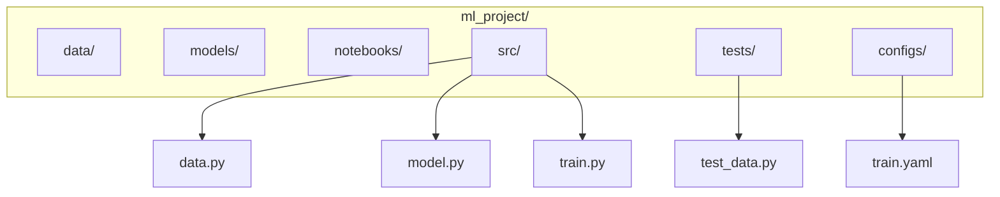

# Ch 5: Software Design & Best Practices - Advanced

**Track**: Foundation | [Try code in Playground](../../playground.md) | [Back to chapter overview](../chapter-05.md)


!!! tip "Read online or run locally"
    You can read this content here on the web. To run the code interactively,
    either use the [Playground](../../playground.md) or clone the repo and open
    `chapters/chapter-05-software-design/notebooks/03_advanced.ipynb` in Jupyter.

---

# Chapter 5: Software Design & Best Practices
## Notebook 03 - Advanced

Structure production-ready ML projects. Version control, documentation, error handling, and a capstone refactor.

**What you'll learn:**
- Project structure for ML projects (full walkthrough)
- Version control best practices (branching for experiments)
- Documentation: docstrings, type hints, README patterns
- Error handling and logging in ML pipelines
- Capstone: refactor a messy ML script into a well-structured project

**Time estimate:** 2 hours

---
*Generated by Berta AI | Created by Luigi Pascal Rondanini*

## 1. ML Project Structure




```python
# Typical structure (conceptual)
structure = """
ml_project/
├── data/           # raw/, processed/
├── models/         # checkpoints, .pkl
├── notebooks/      # exploration, experiments
├── src/
│   ├── data.py     # DataLoader, preprocessing
│   ├── model.py    # Model definitions
│   ├── train.py    # Trainer
│   └── eval.py     # Evaluator
├── tests/
│   └── test_*.py
├── configs/        # train.yaml, eval.yaml
├── README.md
└── requirements.txt
"""
print(structure)
```

## 2. Version Control Best Practices

| Practice | Purpose |
|----------|--------|
| Branch per experiment | `experiment/bert-v2`, `experiment/lr-0.001` |
| Commit config + code together | Reproducible runs |
| `.gitignore` large files | Don't commit data/, models/ (use DVC if needed) |
| Tag releases | `v1.0-model-bert` for deployments |

```python
# .gitignore for ML projects
gitignore = """
# Data (use DVC for versioning)
data/raw/
data/processed/
models/*.pkl
models/checkpoints/

# Environments
.venv/
venv/
__pycache__/
*.pyc

# Jupyter
.ipynb_checkpoints/
"""
print(gitignore)
```

## 3. Documentation: Docstrings & Type Hints

Good docstrings: purpose, args, returns, raises. Type hints enable tooling (mypy, IDE).

```python
from typing import List, Tuple, Optional

def load_and_preprocess(
    path: str,
    normalize: bool = True,
    target_column: Optional[str] = None
) -> Tuple[List[List[float]], List[float]]:
    """
    Load data from path and optionally normalize features.

    Args:
        path: Path to CSV or JSON file.
        normalize: If True, z-score normalize features.
        target_column: Name of target column. If None, last column used.

    Returns:
        Tuple of (features, targets). Each is a list of lists / list.

    Raises:
        FileNotFoundError: If path does not exist.
    """
    # Placeholder implementation
    return [[1.0, 2.0]], [3.0]

print(load_and_preprocess.__doc__)
```

## 4. Error Handling & Logging

Log key events. Handle failures gracefully. Fail fast on invalid config.

```python
import logging

logging.basicConfig(level=logging.INFO, format='%(asctime)s [%(levelname)s] %(message)s')
logger = logging.getLogger(__name__)

def safe_train(config: dict) -> None:
    """Train with proper error handling."""
    if "learning_rate" not in config:
        raise ValueError("Config must contain 'learning_rate'")
    if config["learning_rate"] <= 0:
        raise ValueError("learning_rate must be positive")

    logger.info("Starting training with config: %s", config)
    try:
        # Simulate training
        for epoch in range(3):
            logger.info("Epoch %d completed", epoch)
        logger.info("Training complete")
    except Exception as e:
        logger.exception("Training failed: %s", e)
        raise

safe_train({"learning_rate": 0.001, "epochs": 10})
```

## 5. Capstone: Refactor Messy ML Script

**Before**: Monolithic 80-line script with mixed concerns.

**After**: Config, DataLoader, Model, Trainer, Evaluator — clean separation.

```python
# BEFORE: Messy script (condensed)
def messy_script():
    d = [[i, i*2+0.1] for i in range(1,11)]  # data, model, train all mixed
    X,y=[r[0] for r in d],[r[1] for r in d]
    w,b=0,0
    for _ in range(500):
        preds=[w*x+b for x in X]
        errs=[p-t for p,t in zip(preds,y)]
        w -= 0.02*sum(e*x for e,x in zip(errs,X))/len(X)
        b -= 0.02*sum(errors)/len(X)
    mse = sum((w*x+b-t)**2 for x,t in zip(X,y))/len(X)
    return w,b,mse

# Fix: 'errors' was a typo for 'errs'
def messy_script():
    d = [[i, i*2+0.1] for i in range(1,11)]
    X,y=[r[0] for r in d],[r[1] for r in d]
    w,b=0,0
    for _ in range(500):
        preds=[w*x+b for x in X]
        errs=[p-t for p,t in zip(preds,y)]
        w -= 0.02*sum(e*x for e,x in zip(errs,X))/len(X)
        b -= 0.02*sum(errs)/len(X)
    mse = sum((w*x+b-t)**2 for x,t in zip(X,y))/len(X)
    return w,b,mse

w, b, mse = messy_script()
print(f"Before: w={w:.3f}, b={b:.3f}, MSE={mse:.4f}")
```

```python
# AFTER: Well-structured project components
from typing import List, Tuple

class Config:
    """Centralized configuration."""
    def __init__(self, lr=0.02, epochs=500):
        self.learning_rate = lr
        self.epochs = epochs

class DataLoader:
    """Load and expose data."""
    def __init__(self, data: List[List[float]]):
        self.features = [r[0] for r in data]
        self.targets = [r[1] for r in data]
    def get_xy(self) -> Tuple[List[float], List[float]]:
        return self.features, self.targets

class LinearModel:
    """Simple y = w*x + b."""
    def __init__(self):
        self.w, self.b = 0.0, 0.0
    def predict(self, X: List[float]) -> List[float]:
        return [self.w * x + self.b for x in X]
    def fit_step(self, X, y, lr):
        preds = self.predict(X)
        n = len(X)
        grad_w = (2/n) * sum((p-t)*x for p,t,x in zip(preds,y,X))
        grad_b = (2/n) * sum(p-t for p,t in zip(preds,y))
        self.w -= lr * grad_w
        self.b -= lr * grad_b

class Trainer:
    """Orchestrate training."""
    def __init__(self, model: LinearModel, config: Config):
        self.model = model
        self.config = config
    def fit(self, data: DataLoader) -> None:
        X, y = data.get_xy()
        for _ in range(self.config.epochs):
            self.model.fit_step(X, y, self.config.learning_rate)

class Evaluator:
    """Compute metrics."""
    @staticmethod
    def mse(predictions: List[float], targets: List[float]) -> float:
        n = len(predictions)
        return sum((p-t)**2 for p,t in zip(predictions,targets)) / n

# Main pipeline
config = Config(lr=0.02, epochs=500)
data = DataLoader([[i, i*2+0.1] for i in range(1, 11)])
model = LinearModel()
trainer = Trainer(model, config)
trainer.fit(data)
X, y = data.get_xy()
preds = model.predict(X)
mse = Evaluator.mse(preds, y)
print(f"After: w={model.w:.3f}, b={model.b:.3f}, MSE={mse:.4f}")
```

## 6. Inline SVG with Matplotlib

Create a simple architecture diagram programmatically.

```python
import matplotlib.pyplot as plt
import matplotlib.patches as mpatches

fig, ax = plt.subplots(figsize=(8, 4))
ax.set_xlim(0, 8)
ax.set_ylim(0, 4)
ax.axis('off')

boxes = [
    (0.5, 1.5, 1.2, 1, 'Config'),
    (2.2, 1.5, 1.2, 1, 'DataLoader'),
    (3.9, 1.5, 1.2, 1, 'Model'),
    (5.6, 1.5, 1.2, 1, 'Trainer'),
    (7.0, 1.5, 1.0, 1, 'Evaluator'),
]
colors = ['#3498db', '#27ae60', '#9b59b6', '#e67e22', '#e74c3c']
for i, (x, y, w, h, label) in enumerate(boxes):
    rect = mpatches.FancyBboxPatch((x, y), w, h, boxstyle='round,pad=0.05',
                                    facecolor=colors[i], edgecolor='#2c3e50', linewidth=1)
    ax.add_patch(rect)
    ax.text(x + w/2, y + h/2, label, ha='center', va='center', fontsize=10, color='white', fontweight='bold')
    if i < len(boxes) - 1:
        ax.annotate('', xy=(boxes[i+1][0], y + h/2), xytext=(x + w, y + h/2),
                    arrowprops=dict(arrowstyle='->', color='#34495e'))

ax.set_title('ML Pipeline Architecture')
plt.tight_layout()
plt.savefig('/tmp/ml_pipeline.svg', format='svg', bbox_inches='tight')
plt.show()
print('Saved to /tmp/ml_pipeline.svg')
```

## 7. Summary

- **Project structure**: data/, models/, src/, tests/, configs/.
- **Version control**: Branch per experiment, commit config+code, tag releases.
- **Documentation**: Docstrings (Args, Returns, Raises), type hints.
- **Error handling**: Validate config, log key events, fail fast.
- **Capstone**: Config → DataLoader → Model → Trainer → Evaluator.

You now have the foundations for production-quality ML code.

---
*Generated by Berta AI | Created by Luigi Pascal Rondanini*

---

*[Back to Ch 5 overview](../chapter-05.md) | [Try in Playground](../../playground.md) | [View on GitHub](https://github.com/luigipascal/berta-chapters/tree/main/chapters/chapter-05-software-design/notebooks/03_advanced.ipynb)*