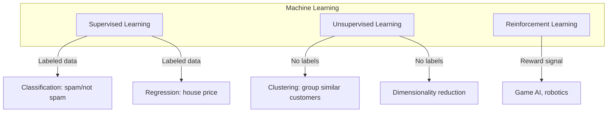

# Ch 6: Introduction to Machine Learning - Introduction

**Track**: Practitioner | [Try code in Playground](../../playground.md) | [Back to chapter overview](../chapter-06.md)


!!! tip "Read online or run locally"
    You can read this content here on the web. To run the code interactively,
    either use the [Playground](../../playground.md) or clone the repo and open
    `chapters/chapter-06-intro-machine-learning/notebooks/01_introduction.ipynb` in Jupyter.

---

# Chapter 6: Introduction to Machine Learning
## Notebook 01 - Introduction

Machine learning is the art of teaching computers to learn from data—without being explicitly programmed for every rule.

**What you'll learn:**
- What is machine learning? (learning from data vs explicit programming)
- Types: supervised, unsupervised, reinforcement learning
- The ML pipeline end-to-end
- Your first ML model: predict house prices with linear regression
- Train/test split: why it matters

**Time estimate:** 2.5 hours

---
*Generated by Berta AI | Created by Luigi Pascal Rondanini*

## 1. What is Machine Learning?

**Traditional programming:** You write rules → Computer applies them → Output

**Machine learning:** You provide data + desired output → Computer learns rules → Predictions on new data

Instead of hand-crafting complex rules (e.g., "if pixel pattern X then digit 7"), we let the algorithm *discover* patterns from examples.

## 2. Types of Machine Learning



| Type | Input | Output | Example |
|------|-------|--------|----------|
| **Supervised** | Features + Labels | Predict label for new data | Spam filter, house price |
| **Unsupervised** | Features only | Discover structure | Customer segmentation |
| **Reinforcement** | Actions + Rewards | Optimal policy | Game playing, robots |

### Interactive: Is this supervised or unsupervised?

Before we proceed, think about each scenario:

1. **Predicting whether a customer will churn** (leave) based on their usage data — supervised or unsupervised?
2. **Grouping news articles into topics** without predefined categories — supervised or unsupervised?
3. **Estimating the sale price of a house** given its features — supervised or unsupervised?

*Answers: 1. Supervised (classification), 2. Unsupervised (clustering), 3. Supervised (regression)*

## 3. The ML Pipeline

Every ML project follows a flow. See the diagram in `assets/diagrams/ml_pipeline.svg`:

**Data Collection → Cleaning → Feature Engineering → Train/Val/Test Split → Model Training → Evaluation → Deployment**

```python
# Display the ML pipeline diagram
from IPython.display import display, SVG
import os

pipeline_path = os.path.join("..", "..", "assets", "diagrams", "ml_pipeline.svg")
if os.path.exists(pipeline_path):
    display(SVG(filename=pipeline_path))
else:
    print("Pipeline: Data Collection → Cleaning → Feature Engineering → Split → Training → Evaluation → Deployment")
```

## 4. Your First ML Model: House Price Prediction

We'll predict house prices using **linear regression**—the simplest supervised learning model.

**What do you think will happen?** If we plot house size (sqft) vs price, do you expect a roughly linear relationship? Why or why not?

```python
import numpy as np
import matplotlib.pyplot as plt

# Realistic house data: sqft -> price (with some noise)
# Based on typical market: ~$200/sqft baseline + noise
np.random.seed(42)
sqft = np.random.uniform(800, 3500, 50)
noise = np.random.normal(0, 30000, 50)
price = 180 * sqft + 50000 + noise

# Visualize the data
plt.figure(figsize=(8, 5))
plt.scatter(sqft, price, alpha=0.7, c='steelblue', edgecolors='navy')
plt.xlabel('Square Feet', fontsize=12)
plt.ylabel('Price ($)', fontsize=12)
plt.title('House Size vs Price (Raw Data)', fontsize=14)
plt.grid(True, alpha=0.3)
plt.tight_layout()
plt.show()

print("Data shape:", sqft.shape)
```

## 5. Linear Regression from Scratch (NumPy)

Linear model: $y = w \cdot x + b$

We'll fit $w$ and $b$ by minimizing Mean Squared Error (MSE) using the closed-form solution (normal equation).

```python
def linear_regression_fit(X, y):
    """Fit y = w*x + b using closed-form solution (normal equation)."""
    X = np.array(X).reshape(-1, 1)
    y = np.array(y)
    # Add column of ones for intercept
    X_b = np.c_[np.ones(len(X)), X]
    # (X^T X)^{-1} X^T y
    params = np.linalg.inv(X_b.T @ X_b) @ X_b.T @ y
    b, w = params[0], params[1]
    return w, b


w, b = linear_regression_fit(sqft, price)
print(f"Fitted model: price = {w:.1f} * sqft + {b:.0f}")
```

```python
# Visualize: scatter plot + fitted line
plt.figure(figsize=(8, 5))
plt.scatter(sqft, price, alpha=0.7, c='steelblue', edgecolors='navy', label='Data')
x_line = np.linspace(sqft.min(), sqft.max(), 100)
y_pred = w * x_line + b
plt.plot(x_line, y_pred, 'r-', linewidth=2, label=f'Fitted: y = {w:.0f}x + {b:.0f}')
plt.xlabel('Square Feet', fontsize=12)
plt.ylabel('Price ($)', fontsize=12)
plt.title('Linear Regression: House Price Prediction', fontsize=14)
plt.legend()
plt.grid(True, alpha=0.3)
plt.tight_layout()
plt.show()
```

## 6. Train/Test Split: Why It Matters

**Problem:** If we evaluate on the same data we trained on, we might get overly optimistic results (the model "memorized" the data).

**Solution:** Split data into **train** (fit the model) and **test** (evaluate on unseen data).

**What do you think will happen?** If we use ALL data for training, will our error on "new" houses be higher or lower than if we had held out a test set?

```python
# Train/test split (80/20)
np.random.seed(42)
indices = np.random.permutation(len(sqft))
split = int(0.8 * len(sqft))
train_idx, test_idx = indices[:split], indices[split:]

sqft_train, sqft_test = sqft[train_idx], sqft[test_idx]
price_train, price_test = price[train_idx], price[test_idx]

# Fit on train only
w, b = linear_regression_fit(sqft_train, price_train)

# Predict on train and test
pred_train = w * sqft_train + b
pred_test = w * sqft_test + b

mse_train = np.mean((pred_train - price_train) ** 2)
mse_test = np.mean((pred_test - price_test) ** 2)

print(f"Train MSE: ${mse_train:,.0f}")
print(f"Test MSE:  ${mse_test:,.0f}")
print(f"Train RMSE: ${np.sqrt(mse_train):,.0f}")
print(f"Test RMSE:  ${np.sqrt(mse_test):,.0f}")
```

```python
# Visualize train vs test points
plt.figure(figsize=(8, 5))
plt.scatter(sqft_train, price_train, alpha=0.7, c='steelblue', label='Train', s=60)
plt.scatter(sqft_test, price_test, alpha=0.9, c='coral', marker='s', label='Test (held out)', s=80)
x_line = np.linspace(sqft.min(), sqft.max(), 100)
plt.plot(x_line, w * x_line + b, 'r-', linewidth=2, label='Model')
plt.xlabel('Square Feet', fontsize=12)
plt.ylabel('Price ($)', fontsize=12)
plt.title('Train/Test Split: Model Evaluated on Unseen Data', fontsize=14)
plt.legend()
plt.grid(True, alpha=0.3)
plt.tight_layout()
plt.show()
```

## Summary

- **Machine learning** = learning from data instead of explicit rules
- **Supervised** (labels) vs **Unsupervised** (no labels) vs **Reinforcement** (rewards)
- **ML Pipeline:** Data → Clean → Features → Split → Train → Evaluate → Deploy
- **Linear regression** predicts a continuous value: $y = w x + b$
- **Train/test split** ensures we measure generalization, not memorization

**Next:** Feature engineering, cross-validation, and evaluation metrics.

---
*Generated by Berta AI | Created by Luigi Pascal Rondanini*

---

*[Back to Ch 6 overview](../chapter-06.md) | [Try in Playground](../../playground.md) | [View on GitHub](https://github.com/luigipascal/berta-chapters/tree/main/chapters/chapter-06-intro-machine-learning/notebooks/01_introduction.ipynb)*