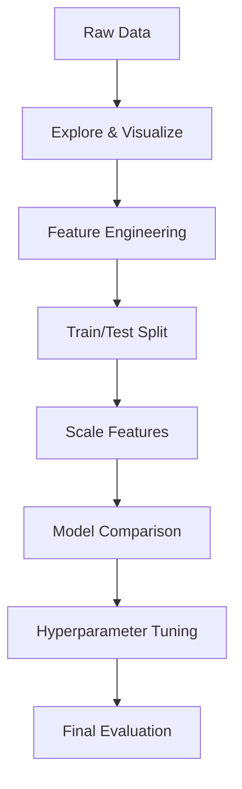

# Ch 6: Introduction to Machine Learning - Advanced

**Track**: Practitioner | [Try code in Playground](../../playground.md) | [Back to chapter overview](../chapter-06.md)


!!! tip "Read online or run locally"
    You can read this content here on the web. To run the code interactively,
    either use the [Playground](../../playground.md) or clone the repo and open
    `chapters/chapter-06-intro-machine-learning/notebooks/03_advanced.ipynb` in Jupyter.

---

# Chapter 6: Introduction to Machine Learning
## Notebook 03 - Advanced: Customer Churn Prediction

Complete end-to-end ML project: from raw data to deployment-ready predictions.

**What you'll learn:**
- Data exploration and visualization
- Feature selection and importance
- Model comparison: Logistic Regression vs Decision Tree vs Random Forest
- Hyperparameter tuning with Grid Search
- Final model evaluation and interpretation

**Time estimate:** 2.5 hours

---
*Generated by Berta AI | Created by Luigi Pascal Rondanini*

## End-to-End ML Pipeline (This Capstone)



## 1. Load and Explore the Customer Churn Data

**Business problem:** Predict which customers will churn (leave) so we can intervene with retention offers.

**What do you think will happen?** Which features (age, tenure, monthly charges, etc.) do you expect to be most predictive of churn?

```python
import numpy as np
import pandas as pd
import matplotlib.pyplot as plt
from sklearn.model_selection import train_test_split, GridSearchCV
from sklearn.preprocessing import StandardScaler, LabelEncoder
from sklearn.linear_model import LogisticRegression
from sklearn.tree import DecisionTreeClassifier
from sklearn.ensemble import RandomForestClassifier
from sklearn.metrics import (
    accuracy_score, precision_score, recall_score, f1_score,
    confusion_matrix, classification_report
)
import os

# Load customer data
data_path = os.path.join("..", "..", "datasets", "customers.csv")
df = pd.read_csv(data_path)

print("Dataset shape:", df.shape)
print("\nFirst 5 rows:")
display(df.head())
print("\nInfo:")
df.info()
```

```python
# Plot 1-4: Exploratory visualizations
fig, axes = plt.subplots(2, 2, figsize=(10, 8))

df['churn'].value_counts().plot(kind='bar', ax=axes[0, 0], color=['steelblue', 'coral'])
axes[0, 0].set_title('Churn Distribution')
axes[0, 0].set_xlabel('Churn')
axes[0, 0].set_ylabel('Count')
axes[0, 0].tick_params(axis='x', rotation=0)

df.boxplot(column='tenure', by='churn', ax=axes[0, 1])
axes[0, 1].set_title('Tenure by Churn')
axes[0, 1].set_xlabel('Churn')
axes[0, 1].set_ylabel('Tenure (months)')
plt.suptitle('')

df.boxplot(column='monthly_charges', by='churn', ax=axes[1, 0])
axes[1, 0].set_title('Monthly Charges by Churn')
axes[1, 0].set_xlabel('Churn')
axes[1, 0].set_ylabel('Monthly Charges ($)')
plt.suptitle('')

df[df['churn'] == 'No']['age'].hist(ax=axes[1, 1], alpha=0.6, label='No Churn', color='steelblue', bins=15)
df[df['churn'] == 'Yes']['age'].hist(ax=axes[1, 1], alpha=0.6, label='Churn', color='coral', bins=15)
axes[1, 1].set_title('Age Distribution by Churn')
axes[1, 1].set_xlabel('Age')
axes[1, 1].set_ylabel('Count')
axes[1, 1].legend()

plt.tight_layout()
plt.show()
```

```python
# Plot 5: Contract type vs churn
fig5, ax5 = plt.subplots(1, 1, figsize=(8, 4))
ct_churn = pd.crosstab(df['contract_type'], df['churn'], normalize='index') * 100
ct_churn.plot(kind='bar', stacked=True, ax=ax5, color=['steelblue', 'coral'])
ax5.set_title('Churn Rate by Contract Type')
ax5.set_xlabel('Contract Type')
ax5.set_ylabel('Percentage')
ax5.legend(['No Churn', 'Churn'])
plt.xticks(rotation=45)
plt.tight_layout()
plt.show()
```

## 2. Feature Engineering and Preparation

Encode categorical variables, handle missing values, and prepare the feature matrix.

```python
# Encode contract_type
le = LabelEncoder()
df['contract_encoded'] = le.fit_transform(df['contract_type'].astype(str))

# Features and target
feature_cols = ['age', 'income', 'tenure', 'monthly_charges', 'total_charges', 'contract_encoded']
X = df[feature_cols].copy()
X['total_charges'] = pd.to_numeric(X['total_charges'], errors='coerce')
X = X.fillna(X.median())
y = (df['churn'] == 'Yes').astype(int)

# Split
X_train, X_test, y_train, y_test = train_test_split(X, y, test_size=0.2, random_state=42, stratify=y)

# Scale
scaler = StandardScaler()
X_train_scaled = scaler.fit_transform(X_train)
X_test_scaled = scaler.transform(X_test)

print("Features:", feature_cols)
print("Train size:", X_train.shape[0], "Test size:", X_test.shape[0])
```

## 3. Feature Importance (using Random Forest)

**What do you think will happen?** Will tenure or monthly_charges be more important for predicting churn?

```python
# Train RF to get feature importances
rf = RandomForestClassifier(n_estimators=100, random_state=42).fit(X_train_scaled, y_train)
importances = rf.feature_importances_
feat_imp = pd.DataFrame({'feature': feature_cols, 'importance': importances}).sort_values('importance', ascending=True)

plt.figure(figsize=(8, 5))
plt.barh(feat_imp['feature'], feat_imp['importance'], color='steelblue')
plt.xlabel('Importance')
plt.title('Feature Importance (Random Forest)')
plt.tight_layout()
plt.show()

print(feat_imp.to_string(index=False))
```

## 4. Model Comparison

Compare three models: Logistic Regression, Decision Tree, Random Forest.

```python
models = {
    'Logistic Regression': LogisticRegression(max_iter=1000, random_state=42),
    'Decision Tree': DecisionTreeClassifier(random_state=42),
    'Random Forest': RandomForestClassifier(n_estimators=100, random_state=42)
}

results = []
for name, model in models.items():
    model.fit(X_train_scaled, y_train)
    y_pred = model.predict(X_test_scaled)
    results.append({
        'Model': name,
        'Accuracy': accuracy_score(y_test, y_pred),
        'Precision': precision_score(y_test, y_pred, zero_division=0),
        'Recall': recall_score(y_test, y_pred, zero_division=0),
        'F1': f1_score(y_test, y_pred, zero_division=0)
    })

results_df = pd.DataFrame(results)
print(results_df.to_string(index=False))
```

```python
# Visualization: Model comparison bar chart
fig, ax = plt.subplots(figsize=(10, 5))
x = np.arange(len(results_df))
width = 0.2
ax.bar(x - 1.5*width, results_df['Accuracy'], width, label='Accuracy')
ax.bar(x - 0.5*width, results_df['Precision'], width, label='Precision')
ax.bar(x + 0.5*width, results_df['Recall'], width, label='Recall')
ax.bar(x + 1.5*width, results_df['F1'], width, label='F1')
ax.set_xticks(x)
ax.set_xticklabels(results_df['Model'])
ax.set_ylabel('Score')
ax.set_title('Model Comparison: Classification Metrics')
ax.legend()
plt.tight_layout()
plt.show()
```

## 5. Hyperparameter Tuning with Grid Search

Tune the best model (Random Forest) using cross-validated grid search.

```python
param_grid = {
    'n_estimators': [50, 100, 150],
    'max_depth': [5, 10, 15, None],
    'min_samples_split': [2, 5, 10]
}

grid = GridSearchCV(RandomForestClassifier(random_state=42), param_grid, cv=5, scoring='f1', n_jobs=-1)
grid.fit(X_train_scaled, y_train)

print("Best params:", grid.best_params_)
print("Best CV F1:", grid.best_score_)
```

## 6. Final Model Evaluation

Evaluate the tuned model on the held-out test set.

```python
best_model = grid.best_estimator_
y_pred_final = best_model.predict(X_test_scaled)

print("Classification Report:")
print(classification_report(y_test, y_pred_final, target_names=['No Churn', 'Churn']))

cm = confusion_matrix(y_test, y_pred_final)
fig, ax = plt.subplots(figsize=(6, 4))
im = ax.imshow(cm, cmap='Blues')
ax.set_xticks([0, 1])
ax.set_yticks([0, 1])
ax.set_xticklabels(['Pred No', 'Pred Yes'])
ax.set_yticklabels(['Act No', 'Act Yes'])
for i in range(2):
    for j in range(2):
        ax.text(j, i, str(cm[i, j]), ha='center', va='center', fontsize=16)
plt.colorbar(im, ax=ax)
plt.title('Final Model: Confusion Matrix')
plt.tight_layout()
plt.show()
```

## 7. Capstone Summary

We built a complete ML pipeline:

1. **Load data** → customers.csv
2. **Explore & visualize** → 5+ plots to understand patterns
3. **Feature engineering** → encode categories, scale, handle missing
4. **Feature importance** → which features matter most
5. **Model comparison** → Logistic Regression, Decision Tree, Random Forest
6. **Hyperparameter tuning** → Grid Search with cross-validation
7. **Final evaluation** → metrics on held-out test set

**You CAN build ML models.** This is the gateway—keep practicing!

---
*Generated by Berta AI | Created by Luigi Pascal Rondanini*

---

*[Back to Ch 6 overview](../chapter-06.md) | [Try in Playground](../../playground.md) | [View on GitHub](https://github.com/luigipascal/berta-chapters/tree/main/chapters/chapter-06-intro-machine-learning/notebooks/03_advanced.ipynb)*