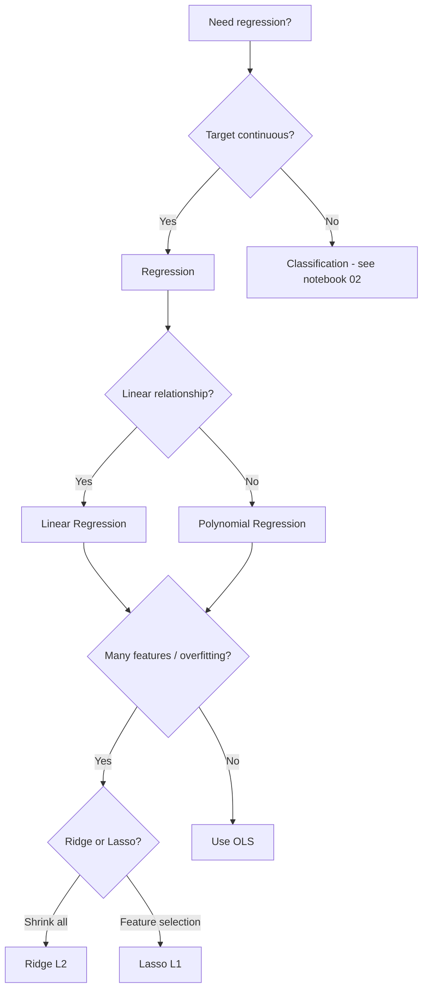

# Ch 7: Supervised Learning - Introduction

**Track**: Practitioner | [Try code in Playground](../../playground.md) | [Back to chapter overview](../chapter-07.md)


!!! tip "Read online or run locally"
    You can read this content here on the web. To run the code interactively,
    either use the [Playground](../../playground.md) or clone the repo and open
    `chapters/chapter-07-supervised-learning/notebooks/01_introduction.ipynb` in Jupyter.

---

# Chapter 7: Supervised Learning - Regression & Classification
## Notebook 01 - Introduction: Regression

Regression predicts continuous values. We start with the classic **linear regression** and build up to polynomial and regularized variants.

**What you'll learn:**
- Linear regression from scratch with NumPy
- Multiple and polynomial regression
- Overfitting and regularization (Ridge, Lasso)
- Scikit-learn interface: fit, predict, score

**Time estimate:** 3 hours

---
*Generated by Berta AI | Created by Luigi Pascal Rondanini*

## 1. Linear Regression: Theory

**Goal:** Predict $y$ from $X$ using $y = X\beta + \varepsilon$

**Closed-form (normal equation):** $\beta = (X^TX)^{-1}X^Ty$

**Gradient descent:** Minimize MSE $= \frac{1}{n}\sum(y_i - \hat{y}_i)^2$

```python
import numpy as np
import matplotlib.pyplot as plt

np.random.seed(42)
n = 80
X = np.random.uniform(0, 10, n)
y = 2.5 * X + 1.5 + np.random.randn(n) * 2

# Linear regression from scratch - normal equation
X_b = np.c_[np.ones((n, 1)), X]
beta = np.linalg.lstsq(X_b.T @ X_b, X_b.T @ y, rcond=None)[0]
b, w = beta[0], beta[1]
y_pred = X_b @ beta

fig, ax = plt.subplots(figsize=(8, 5))
ax.scatter(X, y, alpha=0.7, label='Data')
ax.plot(X, y_pred, 'r-', lw=2, label=f'ŷ = {w:.2f}x + {b:.2f}')
ax.set_xlabel('Feature X')
ax.set_ylabel('Target y')
ax.set_title('Linear Regression: Data + Fitted Line')
ax.legend()
ax.grid(alpha=0.3)
plt.tight_layout()
plt.show()
```

## 2. Residual Plot

Residuals = $y - \hat{y}$. Good fits have residuals centered around 0 with no pattern.

```python
residuals = y - y_pred

fig, axes = plt.subplots(1, 2, figsize=(10, 4))
axes[0].scatter(y_pred, residuals, alpha=0.7)
axes[0].axhline(0, color='red', linestyle='--')
axes[0].set_xlabel('Predicted values')
axes[0].set_ylabel('Residuals')
axes[0].set_title('Residuals vs Predicted')
axes[1].hist(residuals, bins=15, edgecolor='black', alpha=0.7)
axes[1].set_xlabel('Residual')
axes[1].set_ylabel('Frequency')
axes[1].set_title('Residual Distribution')
plt.tight_layout()
plt.show()
```

## 3. Multiple Linear Regression - Housing Prices

Real-world: Predict house price from sqft, bedrooms, bathrooms, age, location_score.

```python
import pandas as pd
from pathlib import Path

df = pd.read_csv(Path('..') / 'datasets' / 'housing.csv')
X = df[['sqft', 'bedrooms', 'bathrooms', 'age', 'location_score']].values
y = df['price'].values

from sklearn.model_selection import train_test_split
X_train, X_test, y_train, y_test = train_test_split(X, y, test_size=0.2, random_state=42)

from sklearn.linear_model import LinearRegression
from sklearn.preprocessing import StandardScaler
scaler = StandardScaler()
X_train_s = scaler.fit_transform(X_train)
X_test_s = scaler.transform(X_test)

lr = LinearRegression()
lr.fit(X_train_s, y_train)
r2 = lr.score(X_test_s, y_test)
print(f'R² on test set: {r2:.4f}')
print('Coefficients:', dict(zip(df.columns[:-1], lr.coef_.round(2))))
```

### Interactive: Predict a house price

Try different values below to see the predicted price.

```python
# Prediction prompt - customize these values
sqft = 2000
bedrooms = 3
bathrooms = 2.0
age = 10
location_score = 7.5

new_house = scaler.transform([[sqft, bedrooms, bathrooms, age, location_score]])
pred_price = lr.predict(new_house)[0]
print(f'Predicted price for {sqft} sqft, {bedrooms} bed, {bathrooms} bath, age {age}: ${pred_price:,.0f}')
```

## 4. Polynomial Regression & Overfitting

Sometimes relationships are nonlinear. Polynomial features can capture curves but risk **overfitting**.

```python
from sklearn.preprocessing import PolynomialFeatures

np.random.seed(42)
X = np.linspace(0, 4*np.pi, 60)
y = np.sin(X) + np.random.randn(60) * 0.3
X = X.reshape(-1, 1)

degrees = [1, 3, 12]
fig, axes = plt.subplots(1, 3, figsize=(12, 4))
X_plot = np.linspace(0, 4*np.pi, 200).reshape(-1, 1)

for i, deg in enumerate(degrees):
    poly = PolynomialFeatures(degree=deg)
    X_poly = poly.fit_transform(X)
    lr = LinearRegression().fit(X_poly, y)
    X_plot_poly = poly.transform(X_plot)
    y_plot = lr.predict(X_plot_poly)
    axes[i].scatter(X, y, alpha=0.6)
    axes[i].plot(X_plot, y_plot, 'r-', lw=2)
    axes[i].set_title(f'Degree {deg}' + (' (overfit!)' if deg == 12 else ''))
    axes[i].set_xlabel('X')
plt.tight_layout()
plt.show()
```

## 5. Regularization: Ridge (L2) and Lasso (L1)

**Ridge:** Adds $\lambda \sum \beta_i^2$ — shrinks all coefficients

**Lasso:** Adds $\lambda \sum |\beta_i|$ — drives some coefficients to exactly 0 (feature selection)

See `assets/diagrams/regression_types.svg` for a visual comparison.



```python
from sklearn.linear_model import Ridge, Lasso

alphas = np.logspace(-4, 2, 50)
coefs_ridge = []
coefs_lasso = []
for a in alphas:
    ridge = Ridge(alpha=a).fit(X_train_s, y_train)
    lasso = Lasso(alpha=a).fit(X_train_s, y_train)
    coefs_ridge.append(ridge.coef_)
    coefs_lasso.append(lasso.coef_)

coefs_ridge = np.array(coefs_ridge)
coefs_lasso = np.array(coefs_lasso)
feat_names = ['sqft', 'bedrooms', 'bathrooms', 'age', 'location_score']

fig, axes = plt.subplots(1, 2, figsize=(12, 5))
for i, name in enumerate(feat_names):
    axes[0].plot(alphas, coefs_ridge[:, i], label=name, lw=2)
    axes[1].plot(alphas, coefs_lasso[:, i], label=name, lw=2)
axes[0].set_xscale('log')
axes[0].set_xlabel('α (regularization strength)')
axes[0].set_ylabel('Coefficient')
axes[0].set_title('Ridge (L2): Coefficient Shrinkage')
axes[0].legend()
axes[1].set_xscale('log')
axes[1].set_xlabel('α (regularization strength)')
axes[1].set_ylabel('Coefficient')
axes[1].set_title('Lasso (L1): Feature Selection (→0)')
axes[1].legend()
plt.tight_layout()
plt.show()
```

## 6. Scikit-learn Interface

All sklearn estimators follow:
- `model.fit(X, y)` — train
- `model.predict(X)` — predict
- `model.score(X, y)` — R² for regression, accuracy for classification

```python
# Compare OLS, Ridge, Lasso on housing
from sklearn.linear_model import LinearRegression, Ridge, Lasso

models = [
    ('OLS', LinearRegression()),
    ('Ridge', Ridge(alpha=1.0)),
    ('Lasso', Lasso(alpha=0.1))
]
for name, model in models:
    model.fit(X_train_s, y_train)
    print(f'{name:8} R² = {model.score(X_test_s, y_test):.4f}')
```

---
*Generated by Berta AI | Created by Luigi Pascal Rondanini*

---

*[Back to Ch 7 overview](../chapter-07.md) | [Try in Playground](../../playground.md) | [View on GitHub](https://github.com/luigipascal/berta-chapters/tree/main/chapters/chapter-07-supervised-learning/notebooks/01_introduction.ipynb)*