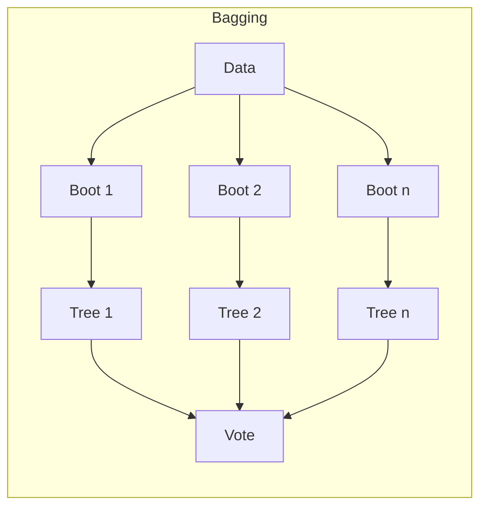

# Ch 7: Supervised Learning - Advanced

**Track**: Practitioner | [Try code in Playground](../../playground.md) | [Back to chapter overview](../chapter-07.md)


!!! tip "Read online or run locally"
    You can read this content here on the web. To run the code interactively,
    either use the [Playground](../../playground.md) or clone the repo and open
    `chapters/chapter-07-supervised-learning/notebooks/03_advanced.ipynb` in Jupyter.

---

# Chapter 7: Supervised Learning - Regression & Classification
## Notebook 03 - Advanced: Ensembles & Credit Risk Capstone

Ensemble methods combine multiple weak learners into a strong one. We implement bagging from scratch, use Random Forest and Gradient Boosting, then build a complete credit risk pipeline.

**What you'll learn:**
- Bagging from scratch, Random Forest, Gradient Boosting
- Feature importance and selection
- Hyperparameter tuning: GridSearchCV, RandomizedSearchCV
- Model interpretation: partial dependence
- Capstone: end-to-end credit risk classification

**Time estimate:** 3.5 hours

---
*Generated by Berta AI | Created by Luigi Pascal Rondanini*

## 1. Ensemble Methods Overview

See `assets/diagrams/ensemble_methods.svg` for Bagging, Boosting, and Stacking.



## 2. Bagging From Scratch

Bootstrap samples → train base estimator on each → majority vote.

```python
import numpy as np
from sklearn.tree import DecisionTreeClassifier

class BaggingClassifierScratch:
    def __init__(self, base_estimator=None, n_estimators=10):
        self.base_estimator = base_estimator or DecisionTreeClassifier(max_depth=5)
        self.n_estimators = n_estimators
        self.estimators = []

    def fit(self, X, y):
        X, y = np.asarray(X), np.asarray(y)
        n = len(y)
        self.estimators = []
        for _ in range(self.n_estimators):
            idx = np.random.choice(n, size=n, replace=True)
            est = DecisionTreeClassifier(max_depth=5)
            est.fit(X[idx], y[idx])
            self.estimators.append(est)
        return self

    def predict(self, X):
        votes = np.array([e.predict(X) for e in self.estimators])
        return np.round(votes.mean(axis=0)).astype(int)

from sklearn.datasets import make_classification
X, y = make_classification(n_samples=200, n_features=10, random_state=42)
bag = BaggingClassifierScratch(n_estimators=20)
bag.fit(X, y)
print(f'Bagging from scratch accuracy: {np.mean(bag.predict(X) == y):.4f}')
```

## 3. Random Forest & Gradient Boosting (sklearn)

**Random Forest:** Bagging + random feature subset per split

**Gradient Boosting:** Sequential correction of residuals

```python
from sklearn.ensemble import RandomForestClassifier, GradientBoostingClassifier
from sklearn.model_selection import cross_val_score

rf = RandomForestClassifier(n_estimators=50, max_depth=5, random_state=42)
gb = GradientBoostingClassifier(n_estimators=50, max_depth=3, random_state=42)

for name, model in [('Random Forest', rf), ('Gradient Boosting', gb)]:
    scores = cross_val_score(model, X, y, cv=5)
    print(f'{name}: CV accuracy = {scores.mean():.4f} ± {scores.std():.4f}')
```

## 4. Feature Importance

Tree-based models provide feature importances (Gini/entropy reduction).

```python
import matplotlib.pyplot as plt
import pandas as pd
from pathlib import Path

df = pd.read_csv(Path('..') / 'datasets' / 'credit.csv')
X_credit = df.drop(columns=['default']).values
y_credit = df['default'].values
feat_names = list(df.columns[:-1])

rf_credit = RandomForestClassifier(n_estimators=100, max_depth=5, random_state=42)
rf_credit.fit(X_credit, y_credit)

imp = rf_credit.feature_importances_
idx = np.argsort(imp)[::-1]
fig, ax = plt.subplots(figsize=(8, 5))
ax.barh([feat_names[i] for i in idx], imp[idx], color='steelblue', alpha=0.8)
ax.set_xlabel('Importance')
ax.set_title('Random Forest: Feature Importance (Credit Default)')
ax.invert_yaxis()
plt.tight_layout()
plt.show()
```

## 5. Hyperparameter Tuning

**GridSearchCV:** Exhaustive search over parameter grid

**RandomizedSearchCV:** Random sampling — faster for large spaces

```python
# Visualize GridSearch results: CV score vs C
import pandas as pd
cv_df = pd.DataFrame(grid.cv_results_)
fig, ax = plt.subplots(figsize=(8, 4))
for solver in cv_df['param_clf__solver'].unique():
    sub = cv_df[cv_df['param_clf__solver'] == solver]
    ax.plot(sub['param_clf__C'], sub['mean_test_score'], 'o-', label=solver)
ax.set_xscale('log')
ax.set_xlabel('C (inverse regularization)')
ax.set_ylabel('CV ROC-AUC')
ax.set_title('GridSearchCV: Logistic Regression Tuning')
ax.legend()
ax.grid(alpha=0.3)
plt.tight_layout()
plt.show()
```

```python
from sklearn.model_selection import GridSearchCV, RandomizedSearchCV
from sklearn.preprocessing import StandardScaler
from sklearn.pipeline import Pipeline
from sklearn.linear_model import LogisticRegression

pipe = Pipeline([
    ('scaler', StandardScaler()),
    ('clf', LogisticRegression(max_iter=1000))
])

param_grid = {'clf__C': [0.01, 0.1, 1, 10], 'clf__solver': ['lbfgs', 'saga']}
grid = GridSearchCV(pipe, param_grid, cv=5, scoring='roc_auc')
grid.fit(X_credit, y_credit)
print(f'Best params: {grid.best_params_}')
print(f'Best CV ROC-AUC: {grid.best_score_:.4f}')
```

## 6. Partial Dependence (Model Interpretation)

How does a single feature affect the prediction, averaging over others?

```python
from sklearn.inspection import PartialDependenceDisplay

fig, ax = plt.subplots(figsize=(10, 6))
PartialDependenceDisplay.from_estimator(
    rf_credit, X_credit, feat_names,
    grid_resolution=20, ax=ax
)
plt.suptitle('Partial Dependence: Credit Default')
plt.tight_layout()
plt.show()
```

## 7. Capstone: Credit Risk Classification Pipeline

End-to-end: exploration → feature engineering → model comparison → tuning → evaluation.

## 5a. Data Exploration (Credit Dataset)

Quick visualization of feature distributions and target balance.

```python
fig, axes = plt.subplots(2, 2, figsize=(10, 8))
axes[0, 0].hist(df['income'], bins=25, edgecolor='black', alpha=0.7)
axes[0, 0].set_title('Income Distribution')
axes[0, 1].hist(df['credit_score'], bins=25, edgecolor='black', alpha=0.7)
axes[0, 1].set_title('Credit Score Distribution')
axes[1, 0].bar(['No Default', 'Default'], [1 - y_credit.mean(), y_credit.mean()], color=['green', 'red'], alpha=0.7)
axes[1, 0].set_title('Target Balance')
axes[1, 1].scatter(df['income'], df['credit_score'], c=y_credit, cmap='RdYlBu_r', alpha=0.6)
axes[1, 1].set_xlabel('Income')
axes[1, 1].set_ylabel('Credit Score')
axes[1, 1].set_title('Income vs Credit Score (colored by default)')
plt.tight_layout()
plt.show()
```

```python
from sklearn.model_selection import train_test_split
from sklearn.metrics import accuracy_score, precision_score, recall_score, f1_score, roc_auc_score, roc_curve

# 1. Data
X_train, X_test, y_train, y_test = train_test_split(X_credit, y_credit, test_size=0.2, random_state=42, stratify=y_credit)
scaler = StandardScaler()
X_train_s = scaler.fit_transform(X_train)
X_test_s = scaler.transform(X_test)

# 2. Model comparison
models = {
    'Logistic': LogisticRegression(max_iter=1000, class_weight='balanced'),
    'Random Forest': RandomForestClassifier(n_estimators=100, max_depth=5, class_weight='balanced'),
    'Gradient Boosting': GradientBoostingClassifier(n_estimators=100, max_depth=3)
}

results = []
for name, model in models.items():
    model.fit(X_train_s, y_train)
    pred = model.predict(X_test_s)
    proba = model.predict_proba(X_test_s)[:, 1]
    results.append({
        'Model': name,
        'Accuracy': accuracy_score(y_test, pred),
        'Precision': precision_score(y_test, pred, zero_division=0),
        'Recall': recall_score(y_test, pred, zero_division=0),
        'F1': f1_score(y_test, pred, zero_division=0),
        'ROC-AUC': roc_auc_score(y_test, proba)
    })

results_df = pd.DataFrame(results)
print(results_df.to_string(index=False))
```

```python
# 3. ROC comparison plot
fig, ax = plt.subplots(figsize=(7, 5))
for name, model in models.items():
    model.fit(X_train_s, y_train)
    proba = model.predict_proba(X_test_s)[:, 1]
    fpr, tpr, _ = roc_curve(y_test, proba)
    ax.plot(fpr, tpr, lw=2, label=f'{name} (AUC={roc_auc_score(y_test, proba):.3f})')
ax.plot([0, 1], [0, 1], 'k--')
ax.set_xlabel('False Positive Rate')
ax.set_ylabel('True Positive Rate')
ax.set_title('Credit Risk: Model Comparison (ROC)')
ax.legend()
ax.grid(alpha=0.3)
plt.tight_layout()
plt.show()
```

### Interactive: Final model prediction

Use the best model to predict for a new applicant.

```python
# Best model (e.g., by ROC-AUC)
best_model = GradientBoostingClassifier(n_estimators=100, max_depth=3)
best_model.fit(X_train_s, y_train)

# Prediction prompt - credit risk
age = 45
income = 38000
debt_ratio = 0.42
credit_score = 580
employment_years = 3

applicant = scaler.transform([[age, income, debt_ratio, credit_score, employment_years]])
prob = best_model.predict_proba(applicant)[0, 1]
pred_class = best_model.predict(applicant)[0]
print(f'Applicant profile: age={age}, income=${income}, debt_ratio={debt_ratio:.2f}, credit_score={credit_score}')
print(f'Default probability: {prob:.1%}')
print(f'Prediction: {"DEFAULT" if pred_class == 1 else "NO DEFAULT"}')
```

## 8. Confusion Matrix & Final Summary

Visualize where the model succeeds and fails.

```python
from sklearn.metrics import confusion_matrix, ConfusionMatrixDisplay

pred_final = best_model.predict(X_test_s)
fig, ax = plt.subplots(figsize=(6, 5))
ConfusionMatrixDisplay.from_predictions(y_test, pred_final, ax=ax, cmap='Blues')
ax.set_title('Credit Risk: Confusion Matrix')
plt.tight_layout()
plt.show()
```

---
*Generated by Berta AI | Created by Luigi Pascal Rondanini*

---

*[Back to Ch 7 overview](../chapter-07.md) | [Try in Playground](../../playground.md) | [View on GitHub](https://github.com/luigipascal/berta-chapters/tree/main/chapters/chapter-07-supervised-learning/notebooks/03_advanced.ipynb)*