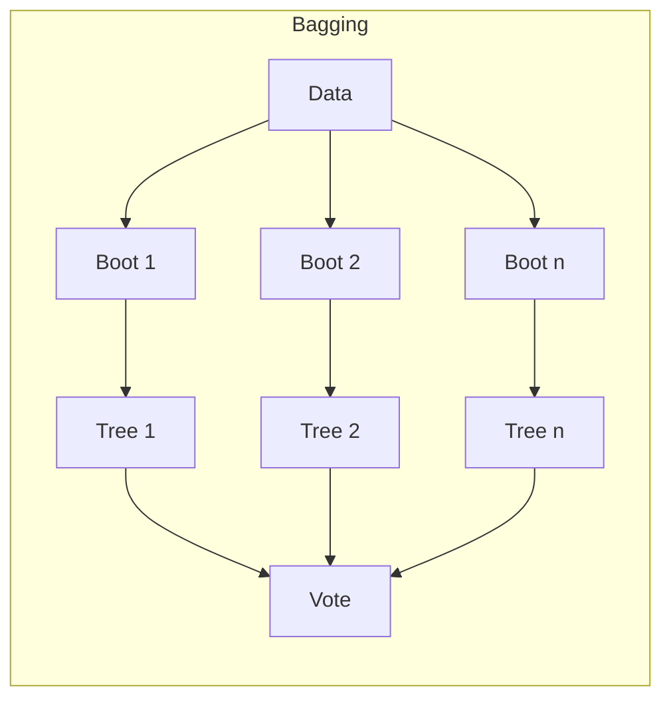

# Ch 7: Supervised Learning - Advanced

**Track**: Practitioner | [Try code in Playground](../../playground.md) | [Back to chapter overview](../chapter-07.md)


!!! tip "Read online or run locally"
    You can read this content here on the web. To run the code interactively,
    either use the [Playground](../../playground.md) or clone the repo and open
    `chapters/chapter-07-supervised-learning/notebooks/03_advanced.ipynb` in Jupyter.

---

# Chapter 7: Supervised Learning - Regression & Classification
## Notebook 03 - Advanced: Ensembles & Credit Risk Capstone

Ensemble methods combine multiple weak learners into a strong one. We implement bagging from scratch, use Random Forest and Gradient Boosting, then build a complete credit risk pipeline.

**What you'll learn:**
- Bagging from scratch, Random Forest, Gradient Boosting
- Feature importance and selection
- Hyperparameter tuning: GridSearchCV, RandomizedSearchCV
- Model interpretation: partial dependence
- Capstone: end-to-end credit risk classification

**Time estimate:** 3.5 hours


**Try it yourself:** Change n_estimators for Random Forest. Try different max_depth. Compare GridSearch vs RandomSearch speed.

---
*Generated by Berta AI | Created by Luigi Pascal Rondanini*

This notebook builds on classification fundamentals to cover ensemble methods—combining many models for better performance. We implement bagging from scratch, then use sklearn's Random Forest and Gradient Boosting. We add feature importance, hyperparameter tuning, and model interpretation before tackling a full credit risk capstone that mirrors real banking workflows.

## 1. Ensemble Methods Overview

**Ensemble intuition: wisdom of crowds.** Combining many weak models often beats one strong model. Why? Each model makes different mistakes; averaging or voting cancels out individual errors. It is like polling multiple experts and taking the majority view.

See assets/diagrams/ensemble_methods.svg for Bagging, Boosting, and Stacking.



## 2. Bagging From Scratch

**Bagging: each model sees a random subset of data, then they vote.** Like polling multiple experts—each gets a different sample, we average their predictions. Bootstrap = sample with replacement. We train many trees on different bootstrap samples and majority-vote.

Bagging embodies the "wisdom of crowds": a single expert can err, but if we poll many independent experts and average their views, we often get a better answer. Here, each tree is trained on a different bootstrap sample of the data—so each "expert" sees a slightly different dataset. When they vote, individual mistakes tend to cancel out. The key is diversity: different training subsets produce different trees, and their combined prediction is more robust than any single tree.

**Implementing bagging:** Each tree trains on a bootstrap sample. We vote by averaging predictions.

```python
import numpy as np
from sklearn.tree import DecisionTreeClassifier

class BaggingClassifierScratch:
    def __init__(self, base_estimator=None, n_estimators=10):
        self.base_estimator = base_estimator or DecisionTreeClassifier(max_depth=5)
        self.n_estimators = n_estimators
        self.estimators = []

    def fit(self, X, y):
        X, y = np.asarray(X), np.asarray(y)
        n = len(y)
        self.estimators = []
        for _ in range(self.n_estimators):
            idx = np.random.choice(n, size=n, replace=True)
            est = DecisionTreeClassifier(max_depth=5)
            est.fit(X[idx], y[idx])
            self.estimators.append(est)
        return self

    def predict(self, X):
        votes = np.array([e.predict(X) for e in self.estimators])
        return np.round(votes.mean(axis=0)).astype(int)

from sklearn.datasets import make_classification
X, y = make_classification(n_samples=200, n_features=10, random_state=42)
bag = BaggingClassifierScratch(n_estimators=20)
bag.fit(X, y)
print(f'Bagging from scratch accuracy: {np.mean(bag.predict(X) == y):.4f}')
```

**What to observe:** The printed accuracy shows how the bagging ensemble performs. Each of the 20 trees was trained on a different bootstrap sample; their majority vote typically outperforms a single tree. You can compare by training one `DecisionTreeClassifier(max_depth=5)` on the same data and checking its accuracy—the ensemble should do better.

**What just happened:** We built bagging from scratch. Twenty trees, each on a random sample, voted. The ensemble typically beats a single tree.

Random Forest adds a second source of randomness to bagging. First, each tree still trains on a bootstrap sample (random data sampling). Second, at every split, only a random subset of features is considered (feature sampling). This extra randomness reduces correlation between trees—they make different kinds of mistakes—so the ensemble improves. Both mechanisms together make Random Forest one of the most robust out-of-the-box classifiers.

Gradient Boosting works differently: it builds trees sequentially, like a tutor focusing on a student's weak areas. The first tree fits the data; the second tree fits the *residuals* (mistakes) of the first; the third fits the remaining errors, and so on. Each new tree corrects what the previous ones got wrong. Unlike bagging, boosting emphasizes difficult examples—later trees concentrate on the cases that were misclassified. This often yields higher accuracy but requires careful tuning (learning rate, depth) to avoid overfitting.

## 3. Random Forest and Gradient Boosting (sklearn)

**Random Forest:** Bagging with decision trees plus random feature selection at each split. More diversity = better ensemble.

**Gradient Boosting:** Each new model focuses on the mistakes of the previous one—like a tutor focusing on weak areas. Sequential correction of errors.

Feature importance tells us which variables the model relies on most for predictions. For trees, it measures how much each feature reduces impurity (Gini or entropy) when used in splits—features used early and often rank higher. This matters for interpretability: regulators and stakeholders want to know why a loan was denied. We can say "credit score and debt ratio drove this decision" instead of "the black box said no." It also guides feature engineering and data collection.

```python
from sklearn.ensemble import RandomForestClassifier, GradientBoostingClassifier
from sklearn.model_selection import cross_val_score

rf = RandomForestClassifier(n_estimators=50, max_depth=5, random_state=42)
gb = GradientBoostingClassifier(n_estimators=50, max_depth=3, random_state=42)

for name, model in [('Random Forest', rf), ('Gradient Boosting', gb)]:
    scores = cross_val_score(model, X, y, cv=5)
    print(f'{name}: CV accuracy = {scores.mean():.4f} ± {scores.std():.4f}')
```

**What to observe:** The cross-validation scores show how Random Forest and Gradient Boosting compare on this dataset. The mean ± std gives an estimate of generalization. Typically one of them will lead; the difference reflects how well the data suits parallel (RF) vs. sequential (GB) ensemble structure.

Partial dependence plots show how a single feature affects the prediction when we average over the others. For credit default, we might see that default probability rises as debt_ratio increases—a monotonic relationship. This helps validate that the model behaves sensibly and supports explanations to regulators and customers.

## 4. Feature Importance

**Feature importance tells us what matters for predictions.** For tree-based models, it measures how much each feature reduces impurity (Gini/entropy) across all splits. High importance = the feature is used often at impactful splits. This matters for interpretability—we can explain to stakeholders which factors drive credit decisions.

```python
import matplotlib.pyplot as plt
import pandas as pd
from pathlib import Path

df = pd.read_csv(Path('..') / 'datasets' / 'credit.csv')
X_credit = df.drop(columns=['default']).values
y_credit = df['default'].values
feat_names = list(df.columns[:-1])

rf_credit = RandomForestClassifier(n_estimators=100, max_depth=5, random_state=42)
rf_credit.fit(X_credit, y_credit)

imp = rf_credit.feature_importances_
idx = np.argsort(imp)[::-1]
fig, ax = plt.subplots(figsize=(8, 5))
ax.barh([feat_names[i] for i in idx], imp[idx], color='steelblue', alpha=0.8)
ax.set_xlabel('Importance')
ax.set_title('Random Forest: Feature Importance (Credit Default)')
ax.invert_yaxis()
plt.tight_layout()
plt.show()
```

**What to observe:** The horizontal bar chart ranks features by importance. Credit score and debt ratio often rank high for default prediction—they are strong signals. Low-importance features might be redundant or weakly predictive; we could consider dropping them to simplify the model or reduce noise.

## 5. Hyperparameter Tuning

**Hyperparameter tuning is finding the best settings**—like turning knobs on a stereo. GridSearch: try every combination in the grid (thorough but slow). RandomSearch: try random combinations (faster for large spaces). We use cross-validation to evaluate each setting.

Hyperparameter tuning is like trying every combination of settings to find the best sound on a stereo—turning each knob (C, max_depth, n_estimators) and listening. GridSearchCV exhaustively tries every combination in the parameter grid we define: C=[0.01, 0.1, 1, 10], solver=['lbfgs','saga'], etc. For each combination, it runs cross-validation to get an honest estimate of performance. The best params are those with the highest CV score. It is thorough but can be slow when the grid is large.

The capstone ties together everything we have learned: data loading, preprocessing, model comparison, and evaluation. We use the credit dataset with real-world structure—imbalanced target, multiple features—and build a pipeline that could be deployed in production. The final output is a model that scores applicants and supports human decision-making.

**Note:** Run the GridSearch cell *below* first to create `grid`. Then return here to visualize how CV score varies with C.

```python
# Visualize GridSearch results: CV score vs C
import pandas as pd
cv_df = pd.DataFrame(grid.cv_results_)
fig, ax = plt.subplots(figsize=(8, 4))
for solver in cv_df['param_clf__solver'].unique():
    sub = cv_df[cv_df['param_clf__solver'] == solver]
    ax.plot(sub['param_clf__C'], sub['mean_test_score'], 'o-', label=solver)
ax.set_xscale('log')
ax.set_xlabel('C (inverse regularization)')
ax.set_ylabel('CV ROC-AUC')
ax.set_title('GridSearchCV: Logistic Regression Tuning')
ax.legend()
ax.grid(alpha=0.3)
plt.tight_layout()
plt.show()
```

**Common mistake:** Overfitting during hyperparameter tuning. If we use the same data for both tuning and evaluation, we can "peek" at the test set by selecting params that work best on it. Always use a held-out test set for final evaluation, or use nested cross-validation. Also avoid tuning too many parameters at once—it increases the risk of finding spurious optima.

```python
from sklearn.model_selection import GridSearchCV, RandomizedSearchCV
from sklearn.preprocessing import StandardScaler
from sklearn.pipeline import Pipeline
from sklearn.linear_model import LogisticRegression

pipe = Pipeline([
    ('scaler', StandardScaler()),
    ('clf', LogisticRegression(max_iter=1000))
])

param_grid = {'clf__C': [0.01, 0.1, 1, 10], 'clf__solver': ['lbfgs', 'saga']}
grid = GridSearchCV(pipe, param_grid, cv=5, scoring='roc_auc')
grid.fit(X_credit, y_credit)
print(f'Best params: {grid.best_params_}')
print(f'Best CV ROC-AUC: {grid.best_score_:.4f}')
```

**What to observe:** The EDA plots reveal income and credit score distributions, the class balance (how many defaults vs. non-defaults), and the relationship between income and credit score colored by default status. Imbalance in the target and any visible clusters or outliers inform our modeling choices.

## 6. Partial Dependence (Model Interpretation)

How does a single feature affect the prediction, averaging over others?

Banks and lenders lose billions on bad loans every year. Credit risk models help predict who will default before we lend—reducing losses while still approving creditworthy applicants. The business trade-off: approve too aggressively and we lose money on defaults; approve too conservatively and we miss good customers and revenue. Regulatory requirements (e.g., fair lending) also demand that we understand and explain our models. This capstone mirrors the real workflow: load data, compare models, tune, and deploy a scored system for loan officers.

```python
from sklearn.inspection import PartialDependenceDisplay

fig, ax = plt.subplots(figsize=(10, 6))
PartialDependenceDisplay.from_estimator(
    rf_credit, X_credit, feat_names,
    grid_resolution=20, ax=ax
)
plt.suptitle('Partial Dependence: Credit Default')
plt.tight_layout()
plt.show()
```

## 7. Capstone: Credit Risk Classification Pipeline

**Credit risk: banks and lenders use ML to predict default.** The cost of a false approve (lend to someone who defaults) is high; the cost of a false decline (reject someone who would have paid) is lost business. We balance these with precision and recall. This pipeline mirrors real workflows: explore data, engineer features, compare models, tune, evaluate.

## 5a. Data Exploration (Credit Dataset)

Quick visualization of feature distributions and target balance.

```python
fig, axes = plt.subplots(2, 2, figsize=(10, 8))
axes[0, 0].hist(df['income'], bins=25, edgecolor='black', alpha=0.7)
axes[0, 0].set_title('Income Distribution')
axes[0, 1].hist(df['credit_score'], bins=25, edgecolor='black', alpha=0.7)
axes[0, 1].set_title('Credit Score Distribution')
axes[1, 0].bar(['No Default', 'Default'], [1 - y_credit.mean(), y_credit.mean()], color=['green', 'red'], alpha=0.7)
axes[1, 0].set_title('Target Balance')
axes[1, 1].scatter(df['income'], df['credit_score'], c=y_credit, cmap='RdYlBu_r', alpha=0.6)
axes[1, 1].set_xlabel('Income')
axes[1, 1].set_ylabel('Credit Score')
axes[1, 1].set_title('Income vs Credit Score (colored by default)')
plt.tight_layout()
plt.show()
```

**Interpreting results in business terms:** The table and ROC curves tell us which model balances risk and approval best. A higher ROC-AUC means better ranking of defaults vs. non-defaults. If Gradient Boosting leads, it may be worth the extra complexity for deployment. Compare recall on defaults—how many risky applicants we catch—vs. precision—how many of our declines were correct. The choice depends on the cost of a missed default vs. the cost of declining a good customer.

```python
from sklearn.model_selection import train_test_split
from sklearn.metrics import accuracy_score, precision_score, recall_score, f1_score, roc_auc_score, roc_curve

# 1. Data
X_train, X_test, y_train, y_test = train_test_split(X_credit, y_credit, test_size=0.2, random_state=42, stratify=y_credit)
scaler = StandardScaler()
X_train_s = scaler.fit_transform(X_train)
X_test_s = scaler.transform(X_test)

# 2. Model comparison
models = {
    'Logistic': LogisticRegression(max_iter=1000, class_weight='balanced'),
    'Random Forest': RandomForestClassifier(n_estimators=100, max_depth=5, class_weight='balanced'),
    'Gradient Boosting': GradientBoostingClassifier(n_estimators=100, max_depth=3)
}

results = []
for name, model in models.items():
    model.fit(X_train_s, y_train)
    pred = model.predict(X_test_s)
    proba = model.predict_proba(X_test_s)[:, 1]
    results.append({
        'Model': name,
        'Accuracy': accuracy_score(y_test, pred),
        'Precision': precision_score(y_test, pred, zero_division=0),
        'Recall': recall_score(y_test, pred, zero_division=0),
        'F1': f1_score(y_test, pred, zero_division=0),
        'ROC-AUC': roc_auc_score(y_test, proba)
    })

results_df = pd.DataFrame(results)
print(results_df.to_string(index=False))
```

```python
# 3. ROC comparison plot
fig, ax = plt.subplots(figsize=(7, 5))
for name, model in models.items():
    model.fit(X_train_s, y_train)
    proba = model.predict_proba(X_test_s)[:, 1]
    fpr, tpr, _ = roc_curve(y_test, proba)
    ax.plot(fpr, tpr, lw=2, label=f'{name} (AUC={roc_auc_score(y_test, proba):.3f})')
ax.plot([0, 1], [0, 1], 'k--')
ax.set_xlabel('False Positive Rate')
ax.set_ylabel('True Positive Rate')
ax.set_title('Credit Risk: Model Comparison (ROC)')
ax.legend()
ax.grid(alpha=0.3)
plt.tight_layout()
plt.show()
```

### Interactive: Final model prediction

Use the best model to predict for a new applicant.

```python
# Best model (e.g., by ROC-AUC)
best_model = GradientBoostingClassifier(n_estimators=100, max_depth=3)
best_model.fit(X_train_s, y_train)

# Prediction prompt - credit risk
age = 45
income = 38000
debt_ratio = 0.42
credit_score = 580
employment_years = 3

applicant = scaler.transform([[age, income, debt_ratio, credit_score, employment_years]])
prob = best_model.predict_proba(applicant)[0, 1]
pred_class = best_model.predict(applicant)[0]
print(f'Applicant profile: age={age}, income=${income}, debt_ratio={debt_ratio:.2f}, credit_score={credit_score}')
print(f'Default probability: {prob:.1%}')
print(f'Prediction: {"DEFAULT" if pred_class == 1 else "NO DEFAULT"}')
```

## 8. Confusion Matrix and Final Summary

**What does this model mean for loan officers?** The confusion matrix shows where we succeed and fail. High recall on defaults = we catch most risky applicants. High precision = when we decline, we are usually right. The model supports human judgment—not replaces it. Final deployment would feed scores to underwriters.

**What a loan officer does with this model:** The model outputs a default probability for each applicant. Low probability (e.g., &lt;20%) → likely approve. High probability (e.g., &gt;60%) → likely decline or require more collateral. The middle range goes to manual review—the officer uses judgment, income docs, and the score together. The confusion matrix shows how often we get it right; the officer trusts the model when it aligns with experience and flags cases for review when it does not. Deployment would feed these scores into the underwriting system.

```python
from sklearn.metrics import confusion_matrix, ConfusionMatrixDisplay

pred_final = best_model.predict(X_test_s)
fig, ax = plt.subplots(figsize=(6, 5))
ConfusionMatrixDisplay.from_predictions(y_test, pred_final, ax=ax, cmap='Blues')
ax.set_title('Credit Risk: Confusion Matrix')
plt.tight_layout()
plt.show()
```

---
*Generated by Berta AI | Created by Luigi Pascal Rondanini*

---

*[Back to Ch 7 overview](../chapter-07.md) | [Try in Playground](../../playground.md) | [View on GitHub](https://github.com/luigipascal/berta-chapters/tree/main/chapters/chapter-07-supervised-learning/notebooks/03_advanced.ipynb)*