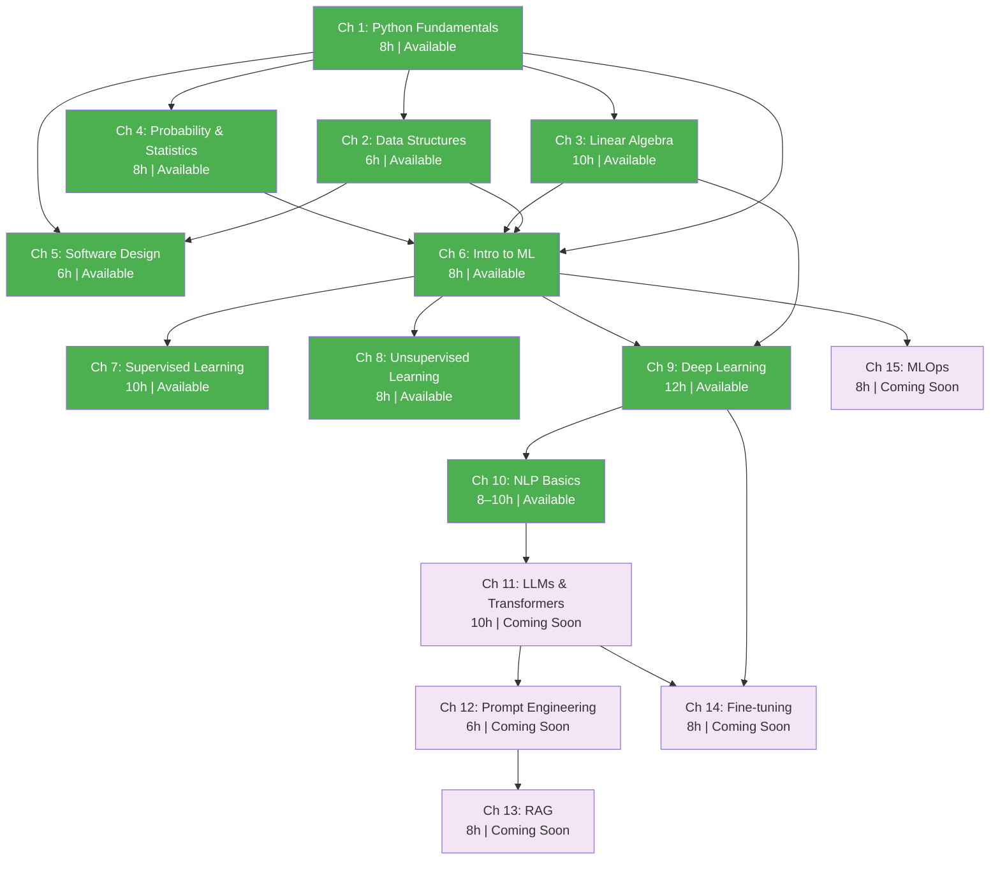

# Syllabus

A visual overview of every chapter, its status, and how they connect.

---

## Chapter Dependency Diagram

---

## Legend

| Color | Meaning |
|-------|---------|
| Green | Available — Full content ready (notebooks, exercises, SVGs) |
| Purple | Coming soon — Practitioner Track (planned) |
| Gray | Planned — Advanced Track |

---

## Status Table

| # | Chapter | Track | Hours | Status |
|---|---------|-------|-------|--------|
| 1 | Python Fundamentals | Foundation | 8h | Available |
| 2 | Data Structures & Algorithms | Foundation | 6h | Available |
| 3 | Linear Algebra & Calculus | Foundation | 10h | Available |
| 4 | Probability & Statistics | Foundation | 8h | Available |
| 5 | Software Design | Foundation | 6h | Available |
| 6 | Introduction to ML | Practitioner | 8h | Available |
| 7 | Supervised Learning | Practitioner | 10h | Available |
| 8 | Unsupervised Learning | Practitioner | 8h | Available |
| 9 | Deep Learning Fundamentals | Practitioner | 12h | Available |
| 10 | NLP Basics | Practitioner | 8–10h | Available |
| 11 | LLMs & Transformers | Practitioner | 10h | Coming soon |
| 12 | Prompt Engineering | Practitioner | 6h | Coming soon |
| 13 | RAG | Practitioner | 8h | Coming soon |
| 14 | Fine-tuning & Adaptation | Practitioner | 8h | Coming soon |
| 15 | MLOps & Deployment | Practitioner | 8h | Coming soon |
| 16 | Multi-Agent Systems | Advanced | 10h | Planned |
| 17 | Advanced RAG | Advanced | 10h | Planned |
| 18 | Reinforcement Learning | Advanced | 12h | Planned |
| 19 | Model Optimization | Advanced | 8h | Planned |
| 20 | Production AI Systems | Advanced | 10h | Planned |
| 21 | AI for Finance | Advanced | 10h | Planned |
| 22 | AI Safety & Alignment | Advanced | 8h | Planned |
| 23 | Building AI Products | Advanced | 8h | Planned |
| 24 | Research & Cutting-Edge | Advanced | 8h | Planned |
| 25 | AI Governance & Ethics | Advanced | 6h | Planned |

---

## Interactive Tools

| Tool | Command | Description |
|------|---------|-------------|
| Learning Hub | `python interactive/berta.py` | Full interactive experience |
| Path Selector | `python interactive/berta.py paths` | Browse learning paths |
| Progress | `python interactive/berta.py status` | Check your progress |
| Quiz | `python interactive/berta.py quiz` | Test your knowledge |
| Chapter Info | `python interactive/berta.py chapter 1` | Get chapter details |

---

**Created by Luigi Pascal Rondanini | Generated by Berta AI**
