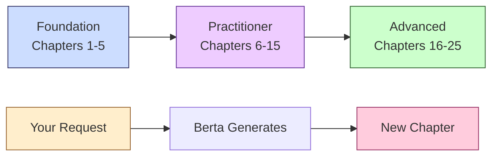

---
hide:
  - navigation
  - toc
---

# Berta Chapters

**Learn AI from fundamentals to mastery through interactive, executable chapters.**

Free. Open-source. Community-driven. Generated by [Berta AI](https://berta.one).

[Start Reading (no setup)](chapters/index.md){ .md-button .md-button--primary }
[Try the Playground](playground.md){ .md-button }
[Install Locally (step-by-step)](guides/setup.md){ .md-button }
[GitHub](https://github.com/luigipascal/berta-chapters){ .md-button }

---

9

Chapters

27

Notebooks

27

Diagrams

76h

Content

47

Exercises

$0

Forever

---

## Available Chapters

### Foundation Track — Complete

| # | Chapter | Hours | Includes |
|---|---------|-------|----------|
| 1 | [Python Fundamentals for AI](chapters/chapter-01.md) | 8h | 3 notebooks, 6 exercises, 3 diagrams |
| 2 | [Data Structures & Algorithms](chapters/chapter-02.md) | 6h | 3 notebooks, 5 exercises, 3 diagrams |
| 3 | [Linear Algebra & Calculus](chapters/chapter-03.md) | 10h | 3 notebooks, 5 exercises, 3 diagrams |
| 4 | [Probability & Statistics](chapters/chapter-04.md) | 8h | 3 notebooks, 5 exercises, 3 diagrams |
| 5 | [Software Design & Best Practices](chapters/chapter-05.md) | 6h | 3 notebooks, 5 exercises, 3 diagrams |

### Practitioner Track — In Progress

| # | Chapter | Hours | Includes |
|---|---------|-------|----------|
| 6 | [Introduction to Machine Learning](chapters/chapter-06.md) | 8h | 3 notebooks, 5 exercises, 3 diagrams |
| 7 | [Supervised Learning](chapters/chapter-07.md) | 10h | 3 notebooks, 5 exercises, 3 diagrams |
| 8 | [Unsupervised Learning](chapters/chapter-08.md) | 8h | 3 notebooks, 5 exercises, 3 diagrams |
| 9 | [Deep Learning Fundamentals](chapters/chapter-09.md) | 12h | 3 notebooks, 5 exercises, 3 diagrams |
| 10–25 | Coming soon | | [View roadmap](guides/roadmap.md) |

---

## Online Playground

Practice Python directly in your browser. No installation required.
Errors are explained in plain English.

[Open the Playground](playground.md){ .md-button .md-button--primary }

14 pre-built exercises covering Chapters 1–6. Load one and start coding.

---

## How This Works

Two streams of content:

1. **Curriculum Path** — 25 structured chapters from Python to advanced AI
2. **Community Chapters** — Custom chapters on any AI topic, [requested by you](guides/chapter-requests.md)

---

## Newsletter

Get notified when new chapters are published.

[Subscribe](newsletter.md){ .md-button }

No spam. At most one email per week. Unsubscribe anytime.

---

## Links

| | |
|---|---|
| [Berta AI](https://berta.one) | Official Berta platform |
| [LLM Cost Optimizer](https://llm.berta.one) | Cut LLM API costs 80–95% |
| [Rondanini Publishing](https://www.rondanini.com) | Independent literary publisher |
| [Luigi Pascal Rondanini](https://rondanini.net) | Author and creator |
| [All Sites](https://sites.rondanini.net) | Full directory |

---

You are visitor number **[0000042]** to this page. Thank you for visiting!

**Created by [Luigi Pascal Rondanini](https://rondanini.net) | Generated by [Berta AI](https://berta.one)**
