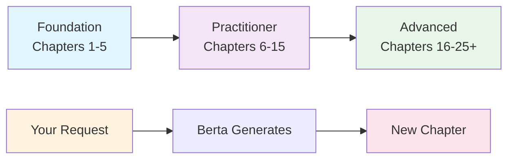

---
hide:
  - navigation
  - toc
---

# :robot: Berta Chapters

**Learn AI from fundamentals to mastery through interactive, executable chapters.**

Every chapter is generated by **[Berta AI](https://berta.one)**. Every chapter is free, open-source, and yours to fork, clone, and modify.

[:octicons-rocket-24: Get Started](guides/getting-started.md){ .md-button .md-button--primary }
[:octicons-book-24: Browse Chapters](chapters/index.md){ .md-button }
[:octicons-git-branch-24: GitHub](https://github.com/luigipascal/berta-chapters){ .md-button }

---

7

Chapters Available

21

Notebooks

21

SVG Diagrams

56h

Learning Content

37

Exercises

$0

Cost. Forever.

---

## :dart: How This Works

Berta Chapters offers **two streams** of content:

=== ":books: Curriculum Path"

    A structured, 25-chapter journey from Python basics to advanced AI specializations.
    Start with Chapter 1 and progress through Foundation, Practitioner, and Advanced tracks.

=== ":sparkles: Community Chapters"

    Custom chapters generated on-demand based on what **you** need to learn.
    [Request a chapter](guides/chapter-requests.md) on any AI topic.

---

## :books: Available Chapters

### Foundation Track :white_check_mark: Complete

| # | Chapter | Time | Content |
|---|---------|------|---------|
| 1 | [Python Fundamentals for AI](chapters/chapter-01.md) | 8h | 3 notebooks, 6 exercises, 3 SVGs |
| 2 | [Data Structures & Algorithms](chapters/chapter-02.md) | 6h | 3 notebooks, 5 exercises, 3 SVGs |
| 3 | [Linear Algebra & Calculus](chapters/chapter-03.md) | 10h | 3 notebooks, 5 exercises, 3 SVGs |
| 4 | [Probability & Statistics](chapters/chapter-04.md) | 8h | 3 notebooks, 5 exercises, 3 SVGs |
| 5 | [Software Design & Best Practices](chapters/chapter-05.md) | 6h | 3 notebooks, 5 exercises, 3 SVGs |

### Practitioner Track :construction: In Progress

| # | Chapter | Time | Content |
|---|---------|------|---------|
| 6 | [Introduction to Machine Learning](chapters/chapter-06.md) | 8h | 3 notebooks, 5 exercises, 3 SVGs |
| 7 | [Supervised Learning](chapters/chapter-07.md) | 10h | 3 notebooks, 5 exercises, 3 SVGs |
| 8-15 | Coming soon | | |

---

## :sparkles: Why Berta Chapters?

- :mortar_board: **Structured Learning** — Follow proven learning paths or create your own
- :computer: **Learn by Doing** — Every chapter has executable code, notebooks, and exercises
- :unlock: **100% Open** — Free, open-source, no paywalls, no tracking
- :robot: **AI-Generated** — Transparently created by [Berta AI](https://berta.one) for consistency
- :package: **GitHub Native** — Clone, fork, contribute—all on GitHub
- :globe_with_meridians: **Community-Driven** — Request chapters you need; community shapes the curriculum

---

## :link: Ecosystem

[:robot: **Berta AI**](https://berta.one){ target=_blank }

Official platform

[:moneybag: **LLM Optimizer**](https://llm.berta.one){ target=_blank }

Cut LLM costs 80-95%

[:books: **Publishing**](https://www.rondanini.com){ target=_blank }

Rondanini Publishing

[:globe_with_meridians: **All Sites**](https://sites.rondanini.net){ target=_blank }

Full directory

---

**Created by [Luigi Pascal Rondanini](https://rondanini.net) | Generated by [Berta AI](https://berta.one)**
